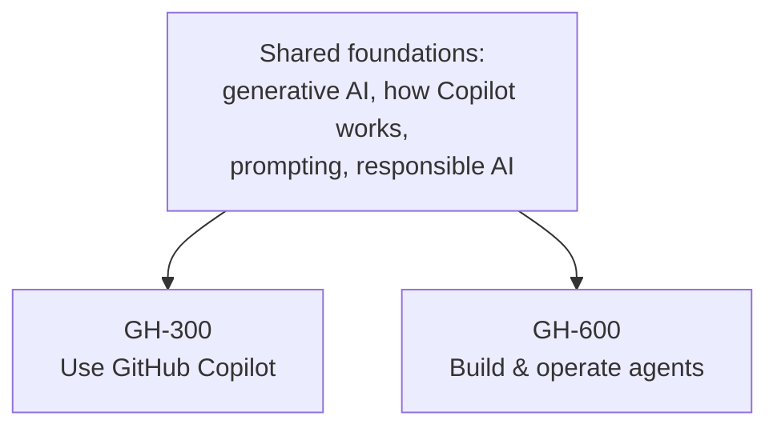

<!-- markdownlint-disable MD041 -->
# Introduction

Artificial intelligence has moved from autocomplete to autonomy. In a few short years, GitHub Copilot went
from suggesting the next line of code to reviewing pull requests, running in your terminal, and — most
recently — operating as an **agent** that plans work, uses tools, and opens pull requests on its own. GitHub,
through Microsoft's certification program, now offers two credentials for the developers and engineers at the
center of this shift. This book prepares you for both:

- **GH-300 — GitHub Copilot**: for the developer who wants to *use* Copilot fluently and responsibly across
  the IDE, the CLI, chat, and Agent Mode.
- **GH-600 — Developing in Agentic AI Systems**: for the engineer who *builds, supervises, and governs*
  autonomous agents inside the software development lifecycle (SDLC), using GitHub as the system of record and
  control plane.

Unlike the sibling volume *Copilot to Transformation* (for the no-code business certifications AB-730 and
AB-731), this book is **hands-on**. It assumes you write code and know your way around Git and GitHub, and it
shows real commands and configuration — Copilot CLI, MCP servers, instructions and prompt files, custom
agents, and CI workflows — alongside the concepts the exams test.

## Who this book is for

You already ship software, and you want to use GitHub Copilot as well as it can be used — or you are moving
from *using* AI to *engineering* it: wiring up tools, giving agents memory, evaluating their output, and
putting guardrails around what they are allowed to do. If either describes you, this book is written for you.
A development background is assumed; no prior agent-building experience is required.

## How the two exams relate

The two certifications share a foundation and then diverge:

Rather than repeat the common ground twice, this book teaches it **once** in Part I, then gives each exam its
own dedicated track. Every exam objective is mapped to a chapter — see Annex C for the full traceability.

## How this book is organized

- **Part I — AI foundations for developers** (shared): what generative AI is, how GitHub Copilot works,
  prompt engineering, and responsible AI.
- **Part II — GH-300 track**: Copilot in the IDE and CLI; Agent Mode, Copilot Edits, MCP, and code review;
  developer productivity; and administering Copilot (policies, privacy, safeguards).
- **Part III — GH-600 track**: agent architecture and SDLC integration; tools and MCP; memory, state, and
  execution; evaluation and tuning; multi-agent orchestration; and guardrails and accountability.
- **Part IV — Exam readiness**: objective checklists, high-yield facts, and a full mock exam for each
  certification.

## How to use this book

Each chapter opens with **"In 30 seconds"** and an **exam map** telling you exactly which objectives it
covers. Along the way you will find callouts: 📌 key concepts, 🔍 how it works, 🎯 exam tips, ⚠️ pitfalls,
💡 tips, 📖 definitions, 🖥️ hands-on commands, and 🔗 sources that link back to the official documentation.
Every chapter ends with **practice questions**; each track ends with a **mock exam** of roughly 40–50
questions.

> 💡 **Tip**: read for understanding first, then try the hands-on snippets in a scratch repository. If you can
> explain a capability in your own words, run it, *and* pick the right answer, you know it.

> 📖 **Prefer to read offline?** Download the latest **[PDF or EPUB](downloads.md)** — rebuilt automatically
> from the same sources on every update.

## A 4-week study plan

A steady, four-week rhythm works well for most readers. Adjust to your pace.

| Week | Focus | Chapters | Goal |
| --- | --- | --- | --- |
| **1** | Foundations (both exams) | Part I (1–4) | Understand generative AI, how Copilot works, prompting, and responsible AI. Do all practice questions. |
| **2** | GH-300 track | Part II (5–8) | Master Copilot in the IDE/CLI, its advanced capabilities, productivity workflows, and administration. |
| **3** | GH-600 track | Part III (9–14) | Master agent architecture, tools/MCP, memory, evaluation, multi-agent orchestration, and guardrails. |
| **4** | Exam readiness | Part IV (15–16) + annexes | Take both mock exams, review weak areas, skim the glossary and product reference. |

> 🎯 **Exam tip**: a passing score is **700** on each exam. GH-300 targets the skills measured **as of
> August 7, 2026**. Before you book, open the official study guide, confirm the objectives haven't changed,
> and check which features are now generally available.

## A note on accuracy

AI products evolve quickly, and features move between Preview and general availability — especially in the
fast-moving world of agents. This book is grounded in official Microsoft Learn and GitHub documentation and
flags where things are likely to change. Commands and configuration are written against current GitHub Docs,
but always confirm against the live documentation before relying on a specific flag or key. When in doubt, the
study guide and product docs are the final word — and the 🔗 sources throughout point you there.

Let's begin.
