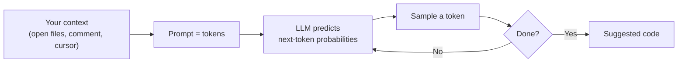

<!-- markdownlint-disable MD041 -->
# Chapter 1 — Understanding Generative AI for Developers

*Part I — AI foundations for developers*

---

## In 30 seconds

- **The core idea**: large language models (LLMs) predict the next token from patterns learned in training;
  GitHub Copilot applies this to *code* with the context of your editor and repository.
- **Why it matters**: understanding what an LLM can and cannot do is the foundation for using Copilot well
  and for reasoning about agents later.
- **The exam angle**: GH-300 tests the **limitations of LLMs and Copilot**; both exams assume you grasp
  tokens, context, and probabilistic generation.
- **Remember**: Copilot *predicts plausible code*, it does not *know* correct code — you stay the author.

---

## Exam map

**Exam map — GH-300 · Understand GitHub Copilot data and architecture (LLM limitations) · Foundation for GH-600**

---

## 1. Key concepts

GitHub Copilot feels like magic the first time an entire function appears from a comment. But there is no
magic — there is a **large language model** doing one thing very well: predicting the next piece of text.
Understanding that single mechanism, and its consequences, is the foundation for everything else in this
book. It is also directly tested: GH-300's data-and-architecture area asks you to describe the **limitations
of LLMs and Copilot**, and the whole GH-600 track assumes you know what a model can and cannot do on its
own.

> 📖 **Definition — Large language model (LLM)**: a neural network trained on vast amounts of text and code
> to predict the most probable next **token** given the tokens so far. Modern LLMs use the *transformer*
> architecture, which lets the model weigh how much each earlier token should influence the next one.

> 📖 **Definition — Token**: the unit an LLM reads and writes — roughly a word fragment. `getUserById` might
> be several tokens (`get`, `User`, `By`, `Id`). Tokens matter because models have a finite **context
> window** (a maximum number of tokens they can consider at once) and because usage is often measured and
> billed in tokens.

### Generative AI, in one sentence

**Generative AI** produces new content — text, code, images — rather than merely classifying or retrieving
existing data. When you ask Copilot to write a function, it is not searching a database of functions and
copying one out; it is **generating** a sequence of tokens that, statistically, looks like correct code for
your context.

> 📌 **Key concept**: Copilot predicts *plausible* code, not *verified* code. A suggestion is the model's
> best guess at what a competent developer would write next — which is often excellent, sometimes subtly
> wrong, and occasionally invented outright. You remain the author and the reviewer.

### Pretraining, then specialization

An LLM is **pretrained** once, at great expense, on a large corpus. That frozen set of learned weights is
then used for **inference** — the fast, cheap step that happens every time you type. Two consequences follow
immediately and both are testable:

- **Knowledge cutoff**: the base model only "knows" what existed in its training data. A brand-new library
  released last week is invisible to the model unless that information is supplied at inference time through
  context (open files, documentation you reference, or tools).
- **No live understanding**: the model has no awareness of your intent, your runtime, or whether its output
  compiles. It pattern-matches; it does not execute.

> 📖 **Definition — Context window**: the maximum number of tokens (prompt + response) a model can process
> in a single request. Everything the model "sees" about your problem must fit inside it — which is why
> *what context Copilot gathers* (Chapter 2) and *how you craft prompts* (Chapter 3) matter so much.

### The two Copilots — do not conflate them

> ⚠️ **Pitfall**: **GitHub Copilot** (the developer tool this book covers — IDE, CLI, agents, MCP) is a
> different product from **Microsoft 365 Copilot** (the business assistant in Word, Teams, and Outlook).
> They share the underlying idea of grounding an LLM in your context, but their surfaces, data handling, and
> exams are distinct. The GH-300 and GH-600 exams concern **GitHub Copilot**.

---

## 2. How it works

### Next-token prediction, one step at a time

Given a sequence of tokens, the model outputs a probability distribution over every possible next token,
picks one, appends it, and repeats. A `for` loop, a variable name, a closing brace — each is chosen because
it is the most probable continuation of everything before it, including the code already in your file.

> 🔍 **How it works**: because the model samples from a probability distribution, generation is
> **non-deterministic** by default. A setting often called *temperature* controls how adventurous the
> sampling is: low temperature favors the single most likely token (predictable, repetitive), higher
> temperature allows less likely tokens (more varied, more creative — and more error-prone). This is why
> the *same* prompt can yield *different* suggestions on two tries.

### Why context is everything

The model's only knowledge of *your* problem is the tokens you give it. Copilot's real skill is assembling
good context — the current file, related open tabs, the file's path and language — into a prompt before the
model ever runs. Chapter 2 traces that assembly in detail. The practical takeaway for now:

> 💡 **Tip**: keep relevant files open and give clear, local cues (a descriptive function name, a leading
> comment, a type signature). You are not "telling the model what to do" so much as *shaping the
> probabilities* toward the code you want.

### Capabilities and limitations, side by side

| The model is strong at… | The model is unreliable at… |
| --- | --- |
| Boilerplate, idiomatic patterns, common algorithms | Facts it was never trained on (new APIs, private code) |
| Translating between languages and styles | Guaranteeing code compiles, runs, or is secure |
| Explaining and summarizing existing code | Arithmetic, precise counting, exact version numbers |
| Drafting tests, docs, and sample data | Knowing *your* business rules or runtime state |

> 📖 **Definition — Hallucination (fabrication)**: a confident, plausible-sounding output that is factually
> wrong — an invented function, a non-existent flag, a mis-remembered API. Hallucinations are not bugs to be
> fully "fixed"; they are an inherent property of probabilistic generation, which is exactly why validation
> (Chapter 4) is mandatory.

---

## 3. In the real world

**Scenario — a helpful suggestion and a hidden trap.** A developer writes a comment,
`// parse an ISO-8601 date and return the Unix timestamp`, and Copilot instantly produces a clean function.
It compiles and passes the happy-path test. But the suggestion silently assumes the local time zone, and for
dates without an explicit offset it returns a value that is wrong by hours. The model produced *plausible*
code — the shape of a correct answer — without *knowing* the correct answer.

The developer who understands next-token prediction is not surprised. She treats the suggestion as a first
draft: she reads it, adds a test for a UTC-vs-local edge case, and fixes the assumption. The one who thinks
Copilot "knows" how to parse dates ships the bug. Same tool, different mental model — and that mental model
is exactly what the exam probes.

---

## 4. Exam tips

> 🎯 **Exam tip**: when a question asks about the **limitations of LLMs/Copilot**, the defensible answers
> cluster around: it can **fabricate**, it has a **knowledge cutoff**, it is **non-deterministic**, it does
> **not execute or verify** code, and it is bounded by a **context window**. Answers implying Copilot
> "understands" intent or "guarantees" correctness are traps.

> 🎯 **Exam tip**: know the vocabulary — **token**, **context window**, **pretraining vs inference**,
> **hallucination/fabrication**, **non-deterministic output**. GH-300 uses these terms directly.

> 🎯 **Exam tip**: any answer that conflates **GitHub Copilot** with **Microsoft 365 Copilot** is wrong on
> these exams. Keep them separate.

---

## 5. Common pitfalls

> ⚠️ **Pitfall**: treating a suggestion as verified truth. Plausible ≠ correct. The model optimizes for
> "looks right," not "is right."

- **"It knows my codebase"**: it only knows the context supplied at inference time. Nothing more is visible
  to the model.
- **"Same prompt, same answer"**: generation is probabilistic; expect variation, and don't rely on a
  specific suggestion reappearing.
- **"Newer is in there"**: the base model can't know about libraries or events after its training cutoff
  unless you supply that information as context.
- **"More context is always better"**: context is finite (the window) and noisy context can crowd out the
  signal. Relevant beats voluminous.

---

## 6. Practice questions

**1.** Which statement best describes how an LLM like the one behind GitHub Copilot generates code?

- A. It searches a database of code snippets and returns the closest match.
- B. It predicts the most probable next token given the preceding context, one token at a time.
- C. It compiles candidate programs and returns the one that passes your tests.
- D. It queries the internet in real time for the latest documentation.

Answer

**Correct: B.** LLMs perform next-token prediction from learned probabilities. A describes retrieval, not
generation; C implies execution/verification the model does not perform; D describes live web access, which
the base model does not have.

**2.** A developer runs the same Copilot prompt twice and gets two different functions. Why?

- A. Copilot is broken and should be reinstalled.
- B. Generation is probabilistic; the model samples from a distribution, so output can vary.
- C. The developer's license expired between attempts.
- D. The context window doubled on the second run.

Answer

**Correct: B.** Sampling from a probability distribution makes output non-deterministic by default. A, C,
and D are unrelated to why suggestions vary.

**3.** Which of the following is a genuine limitation of GitHub Copilot's underlying model?

- A. It can fabricate plausible but incorrect code (hallucination).
- B. It always refuses to generate code it hasn't seen before.
- C. It guarantees that generated code compiles.
- D. It has real-time awareness of your program's runtime state.

Answer

**Correct: A.** Hallucination is inherent to probabilistic generation. B is false (the model generates novel
combinations constantly); C and D describe capabilities the model does not have.

**4.** Why does keeping relevant files open in your editor tend to improve Copilot's suggestions?

- A. It increases the model's temperature setting.
- B. It gives Copilot more relevant context to include in the prompt, shaping predictions toward your code.
- C. It retrains the model on your repository.
- D. It disables the content filters.

Answer

**Correct: B.** Copilot builds the prompt from available context; relevant open files supply useful tokens.
It does not change temperature (A), retrain the model (B is about inference-time context, not training — C
is wrong), or affect filtering (D).

**5.** A question refers to "Copilot" summarizing a Word document in Teams. Within the scope of GH-300 and
GH-600, why is this out of scope?

- A. GitHub Copilot cannot summarize anything.
- B. That describes Microsoft 365 Copilot, a different product from GitHub Copilot.
- C. Summarization is a Preview-only feature.
- D. Word documents exceed every context window.

Answer

**Correct: B.** Word/Teams summarization is Microsoft 365 Copilot territory; these exams concern GitHub
Copilot. A is false, and C/D are fabricated rationales.

---

## Further reading

- **Chapter 2 — How GitHub Copilot Works**: how context becomes a prompt, and the filtering the request
  passes through.
- **Chapter 4 — Using AI Responsibly**: why non-determinism and hallucination make validation non-optional.

> 🔗 **Source**: [Study guide for Exam GH-300: GitHub Copilot](https://learn.microsoft.com/credentials/certifications/resources/study-guides/gh-300)

> 🔗 **Source**: [GitHub Copilot Fundamentals — Part 1 (Microsoft Learn)](https://learn.microsoft.com/training/paths/copilot/)
