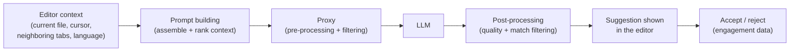

<!-- markdownlint-disable MD041 -->
# Chapter 2 — How GitHub Copilot Works

*Part I — AI foundations for developers*

---

## In 30 seconds

- **The core idea**: Copilot builds a prompt from your context, sends it through a filtering proxy to an
  LLM, and post-processes the result before showing a suggestion.
- **Why it matters**: knowing the data flow explains privacy behavior, latency, and why suggestions vary.
- **The exam angle**: GH-300's data-and-architecture area tests **data usage/flow/sharing**, **input
  processing and prompt building**, **proxy filtering and post-processing**, and the **suggestion
  lifecycle**.
- **Remember**: prompt building → proxy filtering → model → post-processing → suggestion.

---

## Exam map

**Exam map — GH-300 · Understand GitHub Copilot data and architecture (data handling & flow; lifecycle)**

---

## 1. Key concepts

Chapter 1 established what a language model does. This chapter follows a single keystroke through the
machinery that turns your editor context into a suggestion. GH-300 dedicates a whole skill area to it —
**Understand GitHub Copilot data and architecture** — and the questions are concrete: what data is sent,
how the prompt is built, what the proxy filters, and the order of the suggestion lifecycle.

> 📖 **Definition — Prompt (in Copilot's sense)**: the bundle of context Copilot assembles and sends to the
> model. It is more than what you typed: it can include the surrounding code, the file's language and path,
> and snippets from related open tabs. You rarely write the prompt directly — Copilot constructs it for you.

> 📖 **Definition — Proxy**: a GitHub-operated service that sits between your editor and the model. Requests
> and responses pass through it so that filtering (content safety, optional public-code matching) and
> other processing can be applied consistently.

### Three data flows, kept separate

Copilot handles three kinds of data, and the exam expects you to tell them apart:

- **Prompts** — the context sent to generate a suggestion.
- **Suggestions** — what the model returns.
- **Engagement/usage data** — telemetry about acceptances, so features can be measured and improved.

> 📌 **Key concept**: for **Copilot Business** and **Copilot Enterprise**, prompts and suggestions are used
> to produce the response and are **not retained** to train the foundation models, and your code is not
> used as training data. Retention and settings can differ for individual plans, and administrators can
> further restrict data with content exclusions (Chapter 8). Always confirm current terms in the GitHub
> Trust Center before making a compliance claim.

---

## 2. How it works

### The journey of one suggestion

**1. Input processing and prompt building.** Copilot gathers signals from your session — the code before and
after the cursor, the file path and language, and relevant snippets from other open tabs ("neighboring
tabs") — and assembles them into a prompt that fits the model's context window. Better local context (clear
names, a leading comment, an open related file) produces a better prompt, which is the whole basis of
prompt crafting in Chapter 3.

> 🔍 **How it works**: Copilot ranks and trims context to fit the window. It cannot send your entire
> repository; it sends a curated, bounded slice. That is why *which files are open* measurably changes
> suggestions.

**2. Proxy filtering.** The request passes through GitHub's proxy, which applies safety filtering (for
toxic or harmful content) and, on the way back, can apply the optional **duplication detection filter**
that suppresses suggestions matching public code (Chapter 8). The proxy is also where organizational
content exclusions are enforced so that excluded files never reach the model.

**3. Model inference.** The LLM performs next-token prediction (Chapter 1) and returns candidate text.

**4. Post-processing.** Copilot filters low-quality or unsafe candidates, applies the public-code match
filter if enabled, and formats what remains before showing it inline or in chat.

**5. You decide.** Accepting or rejecting produces engagement data. The code you accept is yours to review,
test, and own (Chapter 4).

> 📖 **Definition — Code-suggestion lifecycle**: the ordered path *context → prompt building → proxy
> filtering → model → post-processing → suggestion → accept/reject*. Knowing this order — especially that
> filtering happens **around** the model, not inside it — is a common exam target.

### Where privacy behavior comes from

Because the proxy and prompt-building stages are explicit, the privacy story is explainable rather than
magical: content exclusions stop files from ever being sent; the duplication filter stops certain outputs
from being shown; Business/Enterprise terms govern retention. Each control maps to a specific stage of the
flow.

> 💡 **Tip**: when reasoning about "can Copilot see file X?", think in terms of the flow — is X in the
> gathered context, and is it excluded at the proxy? That framing answers most privacy questions.

---

## 3. In the real world

**Scenario — debugging a "why did it suggest that?" moment.** A developer notices Copilot proposing a
helper that clearly came from *another* file in the project. A teammate assumes Copilot "indexed the whole
repo." The developer who knows the flow explains it correctly: that other file was **open in a neighboring
tab**, so its content entered the gathered context and shaped the prompt. Close the tab, and the suggestion
changes. Later, the team enables content exclusions for a folder of secrets; those files now never reach the
proxy, so Copilot can no longer draw on them. No magic — just the pipeline, understood.

---

## 4. Exam tips

> 🎯 **Exam tip**: memorize the **lifecycle order** and that **filtering happens at the proxy and in
> post-processing — around the model**, not inside it. Questions like "where is the public-code match
> filter applied?" hinge on this.

> 🎯 **Exam tip**: distinguish the three data types — **prompts**, **suggestions**, **engagement data** —
> and know that under **Business/Enterprise**, code and prompts are **not used to train** the models.

> 🎯 **Exam tip**: "neighboring tabs" is real. If asked why an unrelated-looking suggestion appeared,
> *related open files entering the context* is usually the intended answer.

---

## 5. Common pitfalls

> ⚠️ **Pitfall**: believing Copilot "reads your whole repository." It sends a **bounded, ranked slice** of
> context that fits the window — not the entire codebase.

- **Confusing exclusions with the duplication filter**: **content exclusions** limit what Copilot can
  *see* (input side); the **public-code match filter** limits what it can *show* (output side). Different
  stages, different purposes.
- **Assuming code is always used for training**: under Business/Enterprise it is not. Don't over- or
  under-state retention — cite the Trust Center.
- **Thinking filtering is "inside" the model**: it is applied by the proxy and post-processing.

---

## 6. Practice questions

**1.** In what order does a Copilot code suggestion flow?

- A. Model → prompt building → proxy → suggestion
- B. Context gathering → prompt building → proxy filtering → model → post-processing → suggestion
- C. Proxy → model → context gathering → suggestion
- D. Prompt building → model → context gathering → proxy

Answer

**Correct: B.** Context is gathered and built into a prompt, filtered at the proxy, run through the model,
post-processed, then shown. The other orderings misplace one or more stages.

**2.** A suggestion appears that resembles code from a file the developer has open but isn't editing. The
most likely explanation is:

- A. Copilot trained on the repository overnight.
- B. The open file was included as neighboring-tab context in the prompt.
- C. The proxy injected the code.
- D. The duplication filter added it.

Answer

**Correct: B.** Related open tabs contribute to the gathered context. A misdescribes training; C and D
misattribute a filtering stage as a source of content.

**3.** Which control prevents specific files from ever being sent to the model?

- A. The public-code duplication filter
- B. Content exclusions
- C. Temperature settings
- D. The knowledge cutoff

Answer

**Correct: B.** Content exclusions act on the **input** side, keeping files out of the context. The
duplication filter (A) acts on outputs; C and D are unrelated.

**4.** Under Copilot Business/Enterprise, how are your prompts and code used?

- A. They are retained to train the foundation models.
- B. They are used to generate the response and are not used to train the foundation models.
- C. They are published to public repositories.
- D. They are shared with other customers for benchmarking.

Answer

**Correct: B.** Business/Enterprise terms state prompts and code are used to produce the response and not to
train the models. A, C, and D contradict those terms.

**5.** Where is the filter that suppresses suggestions matching public code applied?

- A. Inside the model's weights
- B. In the proxy / post-processing, around the model
- C. In the editor's syntax highlighter
- D. During pretraining

Answer

**Correct: B.** Match filtering is applied around the model (proxy/post-processing), not within it (A),
not by editor tooling (C), and not at training time (D).

---

## Further reading

- **Chapter 1 — Understanding Generative AI for Developers**: the model at the center of this pipeline.
- **Chapter 8 — Administering Copilot**: content exclusions and the public-code duplication filter in depth.

> 🔗 **Source**: [How GitHub Copilot handles your data (GitHub Trust Center)](https://github.com/trust-center)

> 🔗 **Source**: [GitHub Copilot plans and features](https://docs.github.com/copilot/about-github-copilot/plans-for-github-copilot)
