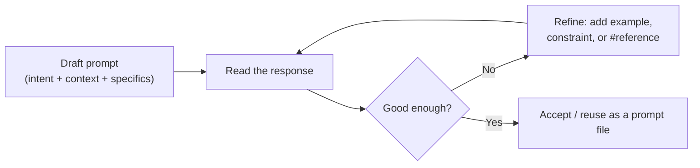

<!-- markdownlint-disable MD041 -->
# Chapter 3 — Prompt Engineering & Context Crafting

*Part I — AI foundations for developers*

---

## In 30 seconds

- **The core idea**: good prompts give Copilot clear intent and the right context; how you structure a
  request materially changes the output.
- **Why it matters**: prompt and context crafting is the highest-leverage skill for day-to-day Copilot use.
- **The exam angle**: GH-300 tests **prompt structure and context**, **how context is determined**,
  **zero-shot and few-shot prompting**, **best practices**, and **prompt process flow / chat-history usage**.
- **Remember**: be specific, provide context, show examples (few-shot), iterate.

---

## Exam map

**Exam map — GH-300 · Apply prompt engineering and context crafting**

---

## 1. Key concepts

Chapter 2 showed that Copilot builds a prompt from context before the model runs. Prompt engineering is the
skill of **steering that context and your instructions** so the model's probabilities bend toward the code
you actually want. GH-300 tests it directly: prompt structure and context, how context is determined,
zero-shot versus few-shot prompting, best practices, and how the chat conversation carries history.

> 📖 **Definition — Prompt engineering**: the practice of designing and refining the instructions and
> context you give an AI — what you ask, how you phrase it, and what you reference — to get more accurate,
> relevant, and useful output.

> 📖 **Definition — Context**: everything the model "sees" for your request — your explicit words plus the
> code Copilot gathers (current file, selection, neighboring tabs) and anything you deliberately reference.
> Weak output is very often a *context* problem, not a *model* problem.

### Anatomy of a strong prompt

A good developer prompt tends to carry four things. You will not always spell out all four, but the
higher-stakes the task, the more each one matters:

- **Intent (goal)** — what you want produced ("write a function that…", "refactor this to…").
- **Context** — the relevant code, constraints, and background ("this runs in a browser, no Node APIs").
- **Specifics** — inputs, outputs, edge cases, libraries, and style ("return a `Result`, handle empty input").
- **Examples** — a sample input/output or a pattern to imitate.

> 📌 **Key concept**: be specific and give the model something to imitate. "Make this better" gives the
> model nothing to optimize for. "Extract the validation into a pure function, add JSDoc, and keep the
> public signature unchanged" gives it a target.

### Zero-shot vs few-shot

> 📖 **Definition — Zero-shot prompting**: asking for the result with **no example** — you rely on the
> model's general training ("Write a regex for a UK postcode").

> 📖 **Definition — Few-shot prompting**: including **one or more examples** of the desired input/output or
> style so the model imitates the pattern ("Given these three sample rows, generate ten more in the same
> shape"). Few-shot is the go-to when format or style must be exact.

---

## 2. How it works

### How Copilot determines context

Copilot assembles context from several sources, and you can influence each:

- **Implicit context** — the current file around your cursor, your active selection, and related open tabs
  (Chapter 2). Managing which files are open is itself a form of prompting.
- **Explicit references** — in Copilot Chat you can point at specific context: chat variables such as
  `#file`, `#selection`, or the whole workspace; participants such as `@workspace`; and `/` slash commands
  such as `/explain`, `/fix`, `/tests`. (Exact syntax varies by IDE — verify in your editor's docs.)
- **Conversation history** — in a chat thread, earlier turns remain in context, so follow-ups like "now add
  error handling" build on what came before.

> 🔍 **How it works**: prompting is a **loop**, not a single shot. Because generation is probabilistic
> (Chapter 1), the reliable path is: draft a focused prompt → read the result → refine (add a constraint,
> an example, or a reference) → repeat. The conversation carries context, so refining usually beats starting
> over.



### Best practices that reliably help

- **One job per prompt** — ask for a single, well-scoped thing; chain follow-ups rather than cramming.
- **Give clear intent and specifics** — name inputs, outputs, edge cases, and the library or style to use.
- **Provide examples (few-shot)** when the format matters — sample data, a target signature, a style to copy.
- **Keep relevant files open** — you are supplying context (Chapter 2).
- **Iterate** — treat the first answer as a draft; "make it shorter," "handle nulls," "add a test."
- **Follow good coding practice in the prompt** — clear names and comments in your code steer better output.

> 🖥️ **Hands-on**: in Copilot Chat, scope the request explicitly and ask for one thing:
>
> ```text
> /tests #selection
> Write unit tests for the selected function. Cover empty input, a single element,
> and a duplicate-key case. Use the project's existing test framework.
> ```

---

## 3. In the real world

**Scenario — from vague to precise.** A developer types `// sort the list` and gets a generic sort that
ignores the domain. Reframed with intent, specifics, and an example, the prompt becomes:

> "Sort `orders` by `priority` descending, then by `createdAt` ascending. `priority` is one of
> `low|medium|high`. Return a new array; don't mutate the input. Example: a `high` order from yesterday
> should come before a `high` order from today."

Copilot now produces a comparator with the right tie-breaker and an explicit priority ordering — because the
prompt supplied the intent, the constraints, and a concrete example to imitate. In a follow-up turn, "now
add a unit test for the tie-break case" reuses the conversation's context instead of re-explaining.

---

## 4. Exam tips

> 🎯 **Exam tip**: know the difference between **zero-shot** (no example) and **few-shot** (one or more
> examples) prompting — and that few-shot is preferred when the output's **format or style** must match.

> 🎯 **Exam tip**: when a weak prompt yields a weak answer, the best fix is usually to **add context or an
> example**, or to **reference the relevant file/selection** — not to repeat the same prompt or switch
> models.

> 🎯 **Exam tip**: iteration and **conversation history** are features. Refining within the same chat
> thread is often the intended "best next step" because earlier turns remain in context.

---

## 5. Common pitfalls

> ⚠️ **Pitfall**: the "one perfect prompt" myth. Strong results come from specificity and iteration, not from
> a single magic sentence.

- **Vagueness**: "make it better" — better *how*? Give a target.
- **No references**: asking about "the config" without referencing the file forces a generic guess.
- **Overstuffing**: a rambling, multi-goal prompt buries the intent and wastes the context window.
- **Ignoring history**: starting a brand-new chat for a follow-up throws away useful context.
- **Wrong context open**: unrelated open tabs can pull suggestions off-target — relevance beats volume.

---

## 6. Practice questions

**1.** Which prompt is most likely to produce correct, well-shaped code?

- A. "Fix this."
- B. "Improve the function."
- C. "Refactor `parseConfig` to return a `Result<Config, Error>`, keep the signature, and add a test for a malformed file."
- D. "Make it faster somehow."

<details markdown="1"><summary>Answer</summary>

**Correct: C.** It states intent, specifics, and a concrete edge case. A, B, and D are vague and give the
model nothing precise to optimize for.

</details>

**2.** You need generated sample rows to match an exact JSON shape. Which technique fits best?

- A. Zero-shot prompting
- B. Few-shot prompting with two example rows
- C. Lowering the temperature only
- D. Opening more unrelated files

<details markdown="1"><summary>Answer</summary>

**Correct: B.** Few-shot examples pin the format. Zero-shot (A) leaves the shape to chance; C and D don't
reliably control structure.

</details>

**3.** A first Copilot Chat answer is close but misses null handling. What is the best next step?

- A. Start a new, unrelated chat and retype the whole request.
- B. In the same thread, ask "now handle null and empty inputs, and add a test."
- C. Switch to a different programming language.
- D. Repeat the original prompt verbatim.

<details markdown="1"><summary>Answer</summary>

**Correct: B.** Iterating within the thread reuses conversation context. A discards context; C is
irrelevant; D changes nothing.

</details>

**4.** In Copilot Chat, what is the purpose of referencing `#selection` or a specific `#file`?

- A. It retrains the model on that file.
- B. It explicitly adds that code to the prompt's context so the answer is grounded in it.
- C. It disables content filtering for that file.
- D. It increases the context window size.

<details markdown="1"><summary>Answer</summary>

**Correct: B.** Explicit references inject specific, relevant context. They don't retrain the model (A),
affect filtering (C), or change the window size (D).

</details>

**5.** Which is the best description of prompt engineering for a developer using Copilot?

- A. Writing code to fine-tune the model on your repo.
- B. Crafting clear instructions and supplying the right context and examples to improve output.
- C. Configuring the proxy server.
- D. Training a new large language model.

<details markdown="1"><summary>Answer</summary>

**Correct: B.** Prompt engineering is about instructions, context, and examples — no model training or
infrastructure work. A, C, and D describe unrelated technical activities.

</details>

---

## Further reading

- **Chapter 2 — How GitHub Copilot Works**: how context is gathered into the prompt in the first place.
- **Chapter 6 — Copilot Capabilities**: reusing prompts with prompt files and setting standards with
  instructions files.

> 🔗 **Source**: [Prompt engineering for GitHub Copilot Chat](https://docs.github.com/copilot/using-github-copilot/copilot-chat/prompt-engineering-for-copilot-chat)

> 🔗 **Source**: [Study guide for Exam GH-300: GitHub Copilot](https://learn.microsoft.com/credentials/certifications/resources/study-guides/gh-300)
