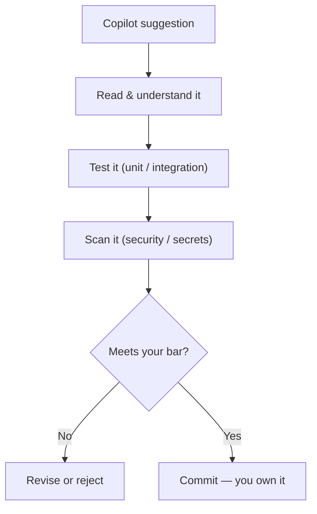

<!-- markdownlint-disable MD041 -->
# Chapter 4 — Using AI Responsibly

*Part I — AI foundations for developers*

---

## In 30 seconds

- **The core idea**: responsible use means understanding the risks of generative AI, validating output, and
  operating Copilot within ethical and organizational boundaries.
- **Why it matters**: you remain accountable for code you accept; unreviewed AI output creates security,
  quality, and licensing risk.
- **The exam angle**: GH-300 tests **risks and limitations**, **ethical/responsible use**, **potential
  harms and mitigations**, **the need to validate AI output**, and **operating Copilot responsibly**.
- **Remember**: human review is non-negotiable — Copilot assists, you decide.

---

## Exam map

**Exam map — GH-300 · Use GitHub Copilot responsibly · Foundation for GH-600 guardrails**

---

## 1. Key concepts

Copilot accelerates your work, but it does not assume responsibility for it. You do. Responsible use means
understanding what can go wrong, validating what the model produces, and operating Copilot within ethical
and organizational boundaries. GH-300 gives this a full skill area (15–20%), and the same instincts become
the foundation for **guardrails** in the GH-600 agent track (Chapter 14).

> 📖 **Definition — Responsible AI**: the practice of designing, building, and using AI systems in ways that
> are fair, reliable and safe, private and secure, inclusive, transparent, and accountable. Microsoft
> organizes its approach around these six principles.

### The six responsible-AI principles

| Principle | What it means in practice with Copilot |
| --- | --- |
| **Fairness** | Watch for biased patterns learned from training data; don't let generated logic encode discrimination. |
| **Reliability & safety** | Suggestions can be wrong or unsafe; test and review before trusting them. |
| **Privacy & security** | Don't expose secrets or sensitive data; use content exclusions; verify generated code isn't insecure. |
| **Inclusiveness** | Consider diverse users and inputs the model may not represent well. |
| **Transparency** | Be clear that AI assisted; understand and explain what the tool does and its limits. |
| **Accountability** | A human remains answerable for the code that ships — Copilot is not accountable, you are. |

> 📌 **Key concept**: Copilot is an assistant, not an authority. Every suggestion is a proposal that you are
> responsible for reviewing, testing, and owning.

### The risks you must be able to name

- **Fabrication (hallucination)** — confident but wrong code, invented APIs or flags (Chapter 1).
- **Insecure patterns** — suggestions can include injection-prone queries, weak crypto, or missing input
  validation, because such patterns exist in training data.
- **Bias** — the model can reproduce biased assumptions present in its training corpus.
- **Outdated practice** — deprecated APIs or old idioms from the knowledge cutoff.
- **Intellectual property / licensing** — a suggestion may resemble public code; the duplication filter
  (Chapter 8) mitigates this, and you remain responsible for compliance.
- **Over-reliance** — accepting output without understanding it erodes quality and your own judgment.

---

## 2. How it works

### Harms, and how to mitigate them

Responsible use is not a vibe; it is a set of concrete mitigations mapped to concrete risks:

| Risk | Mitigation |
| --- | --- |
| Fabrication / wrong code | Human review; unit and integration tests; run it |
| Insecure code | Security review; static analysis / code scanning; the public-code match filter |
| Sensitive-data exposure | Content exclusions; never paste secrets into prompts |
| IP / licensing concerns | Enable the duplication (public-code) filter; review provenance |
| Over-reliance | Only accept code you understand; keep humans in the loop |

> 🔍 **How it works**: the single most important control is **validation**. Because output is probabilistic
> and unverified (Chapters 1–2), you cannot delegate correctness to the model. Review, test, and scan are
> not optional extras — they are how AI-assisted development stays trustworthy.

### Operating Copilot responsibly, day to day

- **Understand before you accept** — if you can't explain a suggestion, don't ship it.
- **Validate output** — tests for behavior, scanning for security, review for design.
- **Protect data** — keep secrets and sensitive files out of context (exclusions), and out of prompts.
- **Be transparent** — follow your organization's norms for disclosing AI assistance.
- **Stay accountable** — the commit has your name on it.

> 🖥️ **Hands-on**: pair Copilot with automated checks. After accepting generated code, ask Copilot Chat to
> generate tests *and* run your scanner (for example, CodeQL / code scanning in CI) so validation is built
> into the workflow, not left to memory.

---

## 3. In the real world

**Scenario — the query that looked fine.** A developer accepts a Copilot suggestion that builds a SQL query
by string-concatenating a user-supplied `search` value. It compiles, it works in the demo, and it is a
textbook SQL-injection vulnerability. Nothing about the suggestion looked alarming — that is precisely the
danger. A responsible workflow catches it: a security review (or a code-scanning alert) flags the
concatenation, the developer switches to a parameterized query, and adds a test with a malicious input.
Copilot helped write the fix, too — but a human's judgment and validation are what kept the vulnerability out
of production.

---

## 4. Exam tips

> 🎯 **Exam tip**: the recurring right answer is **validate the output** — review, test, and scan. Any option
> suggesting you can trust Copilot's code without verification is a trap.

> 🎯 **Exam tip**: be able to list **risks** (fabrication, insecure code, bias, outdated practice,
> IP/licensing, over-reliance) and pair each with a **mitigation**. GH-300 asks about "potential harms and
> mitigation strategies."

> 🎯 **Exam tip**: **accountability stays with the human**. Copilot assists; it is never the responsible
> party for shipped code.

> 🎯 **Exam tip**: recognize the six principles — **fairness, reliability & safety, privacy & security,
> inclusiveness, transparency, accountability**.

---

## 5. Common pitfalls

> ⚠️ **Pitfall**: over-reliance. Accepting code you don't understand transfers risk to production and away
> from your judgment.

- **Assuming generated code is secure**: it may contain injection, weak crypto, or missing validation.
- **Assuming generated code is license-clean by default**: enable the duplication filter and review
  provenance; you remain responsible for compliance.
- **Pasting secrets into prompts**: sensitive data does not belong in context — use exclusions.
- **Skipping tests because "Copilot wrote it"**: authorship by AI raises the need for validation, not lowers
  it.

---

## 6. Practice questions

**1.** A teammate wants to merge Copilot-generated code without review "because the AI wrote it." What is the
responsible position?

- A. Approve it — AI output doesn't need review.
- B. Require review, tests, and security scanning; a human is accountable for the code.
- C. Approve it only if it compiles.
- D. Reject all AI-generated code as a rule.

Answer

**Correct: B.** Validation and human accountability are the core of responsible use. A and C skip validation;
D needlessly bans a useful tool rather than governing it.

**2.** Which pairing of risk and mitigation is correct?

- A. Insecure code → lower the temperature
- B. Sensitive-data exposure → content exclusions and keeping secrets out of prompts
- C. Fabrication → enable dark mode
- D. IP concerns → delete the repository

Answer

**Correct: B.** Exclusions and prompt hygiene mitigate data exposure. A, C, and D pair risks with irrelevant
or absurd "mitigations."

**3.** Which is a genuine responsible-AI concern specific to code suggestions?

- A. Suggestions may reproduce insecure patterns present in training data.
- B. Suggestions are always slower than hand-written code.
- C. Suggestions cannot be edited.
- D. Suggestions disable your compiler.

Answer

**Correct: A.** Models can surface insecure patterns, so review and scanning matter. B, C, and D are false.

**4.** Under the six responsible-AI principles, which one most directly explains why *you* — not Copilot —
answer for shipped code?

- A. Inclusiveness
- B. Transparency
- C. Accountability
- D. Reliability & safety

Answer

**Correct: C.** Accountability places responsibility with the human. The others are real principles but
don't directly assign responsibility for outcomes.

**5.** What is the single most important step before trusting a Copilot suggestion in production?

- A. Accept it quickly to save time.
- B. Validate it — understand, test, and scan the output.
- C. Increase the context window.
- D. Share the prompt publicly.

Answer

**Correct: B.** Validation is the core mitigation for probabilistic, unverified output. A increases risk; C
and D don't address correctness or safety.

---

## Further reading

- **Chapter 1 — Understanding Generative AI for Developers**: why fabrication and non-determinism make
  validation mandatory.
- **Chapter 8 — Administering Copilot**: content exclusions and the public-code duplication filter.
- **Chapter 14 — Guardrails & Accountability**: responsible-AI thinking applied to autonomous agents.

> 🔗 **Source**: [Responsible AI with GitHub Copilot (Microsoft Learn)](https://learn.microsoft.com/training/modules/responsible-ai-with-github-copilot/)

> 🔗 **Source**: [What is Responsible AI? (Microsoft Learn)](https://learn.microsoft.com/azure/machine-learning/concept-responsible-ai)
