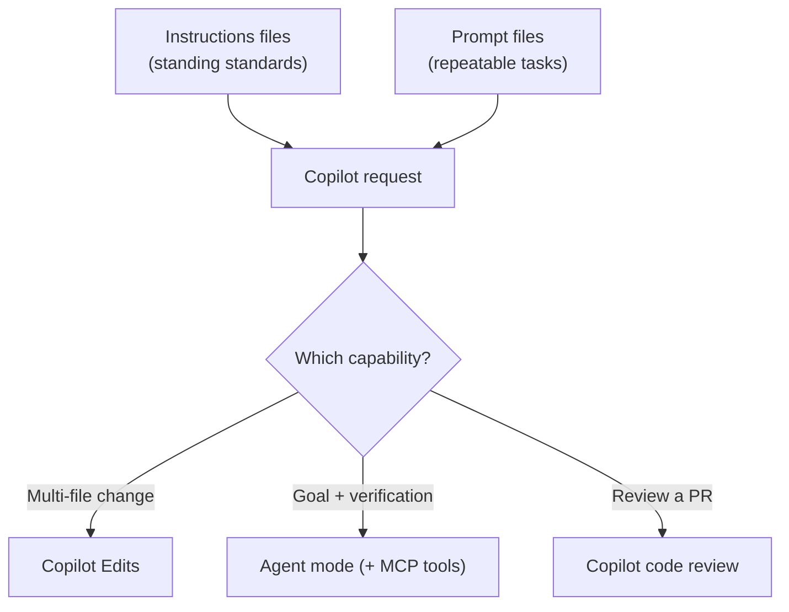

<!-- markdownlint-disable MD041 -->
# Chapter 6 — Copilot Capabilities: Agent Mode, Edits, MCP, Code Review

*Part II — GH-300 track: Working with GitHub Copilot*

---

## In 30 seconds

- **The core idea**: beyond completions, Copilot can make multi-file edits, run as an agent with tools via
  MCP, review code, and reuse your standards through instructions and prompt files.
- **Why it matters**: these capabilities are where Copilot shifts from assistant to collaborator — and they
  are heavily represented on GH-300.
- **The exam angle**: GH-300 tests **Agent Mode, Copilot Edits, and MCP**; **Agent Sessions and
  sub-agents**; **code review and coding assistance**; **Spaces, Spark, PR summaries, and instructions
  files**; and **Chat limits, options, feedback, commands, and prompt-file reuse**.
- **Remember**: instructions files set standards; prompt files make responses repeatable; MCP adds tools.

---

## Exam map

**Exam map — GH-300 · Use GitHub Copilot features and capabilities**

---

## 1. Key concepts

Beyond completing lines, Copilot can make coordinated multi-file edits, act as an agent that uses tools,
review your pull requests, and apply your team's standards automatically. GH-300 tests these under "use
GitHub Copilot features and capabilities." The through-line: you move from *typing code with help* to
*delegating work with oversight*.

### Agent mode vs Copilot Edits vs inline

> 📖 **Definition — Copilot Edits**: an IDE capability where you describe a change and Copilot proposes
> edits **across multiple files at once**, which you review and accept or discard as a set. You stay in
> control of scope — you pick the files in context.

> 📖 **Definition — Agent mode**: Copilot works **autonomously toward a goal** — it decides which files to
> change, runs tools (build, tests, terminal), reads the results, and iterates until the task is done or it
> needs you. Where Copilot Edits applies a described change, agent mode figures out *what* changes are
> needed and *verifies* them.

| | Inline | Copilot Edits | Agent mode |
| --- | --- | --- | --- |
| Scope | Current line/block | Multiple files you scope | Whatever the goal requires |
| Who decides what changes | You | You describe; Copilot edits | Copilot plans and edits |
| Runs tools (tests, terminal) | No | No | Yes |
| Best for | Completions | A known multi-file change | Multi-step tasks and fixes |

### Sub-agents and Agent Sessions

> 📌 **Key concept**: to manage the context window (Chapter 1), Copilot can **delegate** a sub-task to a
> **sub-agent** running in its own context — for example, a code-exploration agent that answers a question
> without cluttering the main conversation. Delegating keeps the primary session focused and optimizes
> token usage.

### The Model Context Protocol (MCP)

> 📖 **Definition — Model Context Protocol (MCP)**: an open standard for connecting AI agents to external
> **tools and data sources** through "MCP servers." Adding an MCP server gives Copilot new abilities — query
> an issue tracker, read observability data, call an internal API — in a consistent, discoverable way.
> Copilot comes with the **GitHub MCP server** preconfigured. (MCP is central to GH-600; here you just need
> to know it *extends what Copilot can do*.)

---

## 2. How it works

### Setting standards with instructions files

> 📖 **Definition — Instructions file**: a Markdown file of natural-language guidance that Copilot
> automatically applies to requests in a repository. **Repository-wide** instructions live in
> `.github/copilot-instructions.md`; **path-specific** instructions live in
> `.github/instructions/NAME.instructions.md` with an `applyTo` glob in the frontmatter; **agent
> instructions** can live in `AGENTS.md` files.

> 🖥️ **Hands-on**: create repository-wide standards Copilot will apply automatically.
>
> ```markdown
> <!-- .github/copilot-instructions.md -->
> - Use TypeScript strict mode and prefer named exports.
> - Write a unit test for every new function.
> - Follow the existing error-handling pattern (return Result, don't throw).
> ```
>
> ```markdown
> <!-- .github/instructions/python.instructions.md -->
> ---
> applyTo: "**/*.py"
> ---
> Use type hints and docstrings. Prefer pathlib over os.path.
> ```

> 🔍 **How it works**: when several instruction sets apply, **personal** instructions take priority, then
> **repository**, then **organization** — but all relevant sets are provided to Copilot. Avoid contradictory
> guidance. For Copilot code review, instructions are read from the **head branch** of a pull request, so
> you can test instruction changes in the same PR.

### Reusing requests with prompt files

> 📖 **Definition — Prompt file**: a reusable, parameterizable prompt saved in the repository (for example,
> under `.github/prompts/`) so a team runs the *same* well-crafted request the same way every time — "scaffold
> a REST endpoint," "write tests to our standard." Instructions files set *standing rules*; prompt files
> package *repeatable tasks*.

### Copilot code review

> 📖 **Definition — Copilot code review**: Copilot reviews a pull request (or changes in the IDE/CLI),
> surfacing likely bugs, style issues, and improvements as comments — optionally guided by your
> instructions files so the review enforces your team's standards. It complements, not replaces, human
> review.

Copilot can also generate **pull request summaries**, and features such as **Spaces** (curated context you
can reuse and share) and **Spark** (building an app from a description) extend where and how you work with
Copilot. Confirm current availability and scope in GitHub Docs — some are evolving.

### Managing the chat conversation

Copilot Chat has **limits** (the context window), **options** (model selection, references), **commands**
(`/explain`, `/fix`, `/tests`), and a **feedback** mechanism. Reusing prompt files keeps responses
consistent across a team.



---

## 3. In the real world

**Scenario — a feature, shipped with standards baked in.** A team adds `.github/copilot-instructions.md`
("strict TypeScript, named exports, a test per function") and a prompt file for scaffolding endpoints. A
developer opens **agent mode** and says, "add a `/orders` endpoint with validation and tests." Copilot
plans the change, edits the router, controller, and test files, runs the tests, fixes a failing case, and
stops for review — automatically following the repo's instructions. When the pull request opens, **Copilot
code review** (reading the same instructions from the head branch) flags a missing null check before a
human reviewer even looks. Standards were enforced without anyone restating them.

---

## 4. Exam tips

> 🎯 **Exam tip**: distinguish **Copilot Edits** (you describe a change; Copilot edits multiple files you
> scope) from **agent mode** (Copilot decides what to change *and runs tools to verify*). "Runs the tests
> and iterates" points to agent mode.

> 🎯 **Exam tip**: **instructions files** set standing standards (`.github/copilot-instructions.md`,
> path-specific `*.instructions.md`, `AGENTS.md`); **prompt files** package repeatable requests. Don't swap
> the two.

> 🎯 **Exam tip**: **MCP** *extends* Copilot with external tools/data. The GitHub MCP server is built in.

> 🎯 **Exam tip**: for Copilot code review, custom instructions are read from the pull request's **head
> branch**, and code review must have custom instructions enabled (the default).

---

## 5. Common pitfalls

> ⚠️ **Pitfall**: writing contradictory instructions across personal, repository, and organization scopes.
> All apply; conflicts degrade quality. Keep them coherent.

- **Confusing instructions files with prompt files**: rules vs repeatable tasks.
- **Expecting agent mode to be "just bigger autocomplete"**: it plans, edits across files, and runs tools —
  review its work.
- **Assuming Copilot code review replaces human review**: it augments it; accountability stays human
  (Chapter 4).
- **Forgetting the head-branch rule**: code-review instructions come from the PR's head branch, not base.

---

## 6. Practice questions

**1.** A developer says, "implement this feature, run the tests, and fix anything that fails." Which
capability is designed for that?

- A. Inline suggestions
- B. Copilot Edits
- C. Agent mode
- D. A prompt file alone

<details markdown="1"><summary>Answer</summary>

**Correct: C.** Agent mode plans, edits across files, and runs tools (like tests), iterating on failures.
Inline (A) completes code; Copilot Edits (B) applies a described multi-file change but doesn't run tools; a
prompt file (D) is just a reusable request.

</details>

**2.** Where do repository-wide custom instructions for Copilot live?

- A. `.github/copilot-instructions.md`
- B. `README.md`
- C. `.gitignore`
- D. `package.json`

<details markdown="1"><summary>Answer</summary>

**Correct: A.** Repository-wide instructions are in `.github/copilot-instructions.md`; path-specific ones
live under `.github/instructions/`. The others are unrelated files.

</details>

**3.** What is the purpose of adding an MCP server to Copilot?

- A. To retrain the model on your repository.
- B. To extend Copilot with external tools and data sources through a standard protocol.
- C. To disable the content filters.
- D. To increase your Copilot license count.

<details markdown="1"><summary>Answer</summary>

**Correct: B.** MCP connects agents to tools/data in a standard way. A, C, and D describe unrelated things.

</details>

**4.** When multiple sets of custom instructions apply to a request, which takes priority?

- A. Organization, then repository, then personal
- B. Personal, then repository, then organization
- C. Only the repository set is used
- D. Only the organization set is used

<details markdown="1"><summary>Answer</summary>

**Correct: B.** Personal instructions take highest priority, then repository, then organization — though all
relevant sets are provided to Copilot. C and D are false; A reverses the order.

</details>

**5.** What best distinguishes an instructions file from a prompt file?

- A. They are identical.
- B. Instructions files set standing standards applied automatically; prompt files package repeatable requests.
- C. Prompt files disable agent mode; instructions files enable it.
- D. Instructions files only work in the CLI.

<details markdown="1"><summary>Answer</summary>

**Correct: B.** Instructions = standing rules; prompt files = reusable tasks. A, C, and D are incorrect.

</details>

---

## Further reading

- **Chapter 5 — Copilot in the IDE and CLI**: the surfaces these capabilities build on.
- **Chapter 10 — Tool Use & Environment Interaction (MCP)**: MCP servers, registries, and allow lists in
  depth (GH-600).

> 🔗 **Source**: [Adding repository custom instructions for GitHub Copilot](https://docs.github.com/copilot/how-tos/configure-custom-instructions/add-repository-instructions)

> 🔗 **Source**: [Extending Copilot with the Model Context Protocol (MCP)](https://docs.github.com/copilot/customizing-copilot/using-model-context-protocol/extending-copilot-chat-with-mcp)
