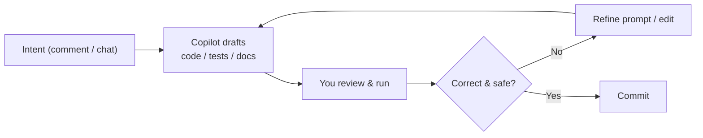

<!-- markdownlint-disable MD041 -->
# Chapter 7 — Boosting Developer Productivity

*Part II — GH-300 track: Working with GitHub Copilot*

---

## In 30 seconds

- **The core idea**: Copilot accelerates the everyday loop — generating, refactoring, documenting, testing,
  and hardening code — while you steer and verify.
- **Why it matters**: productivity is the whole point of the tool, and GH-300 tests concrete use cases.
- **The exam angle**: GH-300 tests **code generation, refactoring, documentation**; **accelerating learning
  and reducing context switching**; **sample data and legacy modernization**; **unit/integration tests,
  edge cases, assertions**; and **security improvements and performance optimizations**.
- **Remember**: Copilot drafts; tests and review confirm.

---

## Exam map

**Exam map — GH-300 · Improve developer productivity with GitHub Copilot**

---

## 1. Key concepts

Everything so far — how the model works, how to prompt it, which surface to use — exists to make you faster
and your code better. GH-300 tests concrete productivity use cases directly, and they cluster into a simple
loop: Copilot **drafts**, you **verify**. This chapter is a tour of where that loop pays off across the
development lifecycle.

> 📌 **Key concept**: Copilot's productivity gains are real but conditional. They show up when you use it
> for the right tasks — boilerplate, tests, docs, translation, exploration — and keep a human validating the
> output (Chapter 4). Speed without verification is just faster bugs.

### Where Copilot helps most

- **Code generation** — scaffolding, boilerplate, well-known algorithms, repetitive patterns.
- **Refactoring** — extracting functions, renaming, restructuring, applying a pattern consistently.
- **Documentation** — docstrings, README sections, inline comments, usage examples.
- **Learning & reduced context switching** — explaining unfamiliar code or APIs *in your editor* instead of
  a web search.
- **Sample data** — realistic fixtures and seed data in the exact shape you need.
- **Legacy modernization** — translating idioms, upgrading patterns, explaining old code before you change it.

> 📖 **Definition — Context switching**: the productivity cost of leaving your task to look something up
> elsewhere. By answering questions and generating examples in place, Copilot reduces these switches — a
> significant, if hard-to-measure, gain.

---

## 2. How it works

### Testing: generation, edge cases, and assertions

Test support is one of Copilot's highest-value use cases and a named GH-300 objective. Copilot can generate
**unit and integration tests**, propose **edge cases** you might miss (empty input, boundaries, duplicates,
nulls, concurrency), and write **assertions** that check the right behavior.

> 🖥️ **Hands-on**: scope the request and ask for the cases that matter.
>
> ```text
> /tests #selection
> Generate unit tests for the selected function. Include: empty input, a single element,
> a very large input, and a malformed record. Use the project's existing test framework
> and assert both the return value and that no exception is thrown for valid input.
> ```

> ⚠️ **Pitfall**: a generated test that *passes* is not automatically a *good* test. Confirm it asserts the
> intended behavior — Copilot can write a test that locks in a bug.

### Security and performance suggestions

Copilot can **suggest security improvements** (parameterized queries instead of string concatenation, input
validation, safer defaults) and **performance optimizations** (removing needless work in a loop, better data
structures). Treat these as *proposals* to validate with review and scanning (Chapter 4), not guarantees.

### Generation, refactoring, and documentation in practice



> 🔍 **How it works**: the win comes from *drafting speed*. Producing a first version of tests, a docstring,
> or a refactor is where most time is spent; Copilot collapses that to seconds, leaving you to do the
> higher-value work of judging and correcting it.

### Generating sample data and modernizing legacy code

Need 50 realistic user records as JSON matching a schema? Ask, with two examples (few-shot, Chapter 3).
Facing a legacy module? Ask Copilot to **explain** it first, then to **modernize** a piece at a time — with
tests around each change so you can trust the transformation.

---

## 3. In the real world

**Scenario — a Friday-afternoon refactor.** A developer must extract validation logic duplicated across
three handlers, add tests, and document the new helper. She asks Copilot to **explain** the current
duplication, uses **Copilot Edits** to extract a shared `validateOrder` function across the files, then
prompts `/tests` for the helper — explicitly requesting empty-input and boundary cases. Copilot drafts the
tests; two fail, revealing a real edge case the old code mishandled. She fixes the helper, asks for a
docstring, and opens a pull request. What would have been an hour of tedium is fifteen minutes of
judgment — because Copilot did the drafting and she did the verifying.

---

## 4. Exam tips

> 🎯 **Exam tip**: know the productivity use cases by name — **generation, refactoring, documentation,
> tests (with edge cases and assertions), sample data, legacy modernization, security and performance
> suggestions**. GH-300 asks which task Copilot is well suited to.

> 🎯 **Exam tip**: the correct framing is always **draft then verify**. Any answer implying Copilot's
> tests or security fixes can be trusted without review is wrong.

> 🎯 **Exam tip**: "reducing context switching" and "accelerating learning" are legitimate, tested benefits
> — explaining code in the editor counts.

---

## 5. Common pitfalls

> ⚠️ **Pitfall**: trusting a green test suite Copilot wrote without checking that the assertions are
> meaningful. Passing ≠ correct.

- **Treating performance/security suggestions as guarantees**: validate with scanning and benchmarks.
- **Over-generating**: asking for a huge change in one shot buries errors; work in reviewable steps.
- **Skipping the explanation step on legacy code**: understand before you modernize.
- **Ignoring the edge cases**: the value of Copilot's test help is largely in the cases you'd have missed —
  ask for them explicitly.

---

## 6. Practice questions

**1.** Which is the most appropriate, well-suited task for GitHub Copilot?

- A. Guaranteeing that a function is free of all security vulnerabilities.
- B. Generating unit tests and proposing edge cases for a function, which you then review.
- C. Deciding your product roadmap.
- D. Certifying code as production-ready without human review.

<details markdown="1"><summary>Answer</summary>

**Correct: B.** Test generation with edge-case suggestions is a core, well-suited use case — followed by
review. A and D overclaim guarantees; C is outside the tool's role.

</details>

**2.** A generated unit test passes on the first run. What should you do before relying on it?

- A. Nothing — a passing test is always correct.
- B. Verify the test actually asserts the intended behavior and covers meaningful cases.
- C. Delete your other tests.
- D. Increase the temperature.

<details markdown="1"><summary>Answer</summary>

**Correct: B.** A passing test can still assert the wrong thing (even lock in a bug). A is unsafe; C and D
are irrelevant.

</details>

**3.** How does Copilot most directly reduce context switching?

- A. By training a model on your browser history.
- B. By explaining unfamiliar code and generating examples in the editor, so you don't leave to search.
- C. By blocking access to the internet.
- D. By disabling other extensions.

<details markdown="1"><summary>Answer</summary>

**Correct: B.** Answering questions and producing examples in place keeps you in flow. A, C, and D don't
describe how Copilot works.

</details>

**4.** You need to modernize a poorly understood legacy module. What is the best first step with Copilot?

- A. Ask it to rewrite the whole module at once with no tests.
- B. Ask it to explain the module, then modernize incrementally with tests around each change.
- C. Delete the module and hope for the best.
- D. Ask it to guarantee the rewrite is bug-free.

<details markdown="1"><summary>Answer</summary>

**Correct: B.** Understand first, then change in small, verified steps. A is risky; C is reckless; D expects
a guarantee Copilot can't give.

</details>

**5.** Copilot suggests replacing a string-concatenated SQL query with a parameterized one. How should you
treat this?

- A. As a guaranteed fix requiring no further checks.
- B. As a helpful security *suggestion* to review, test, and scan before shipping.
- C. As irrelevant to security.
- D. As a reason to skip code review.

<details markdown="1"><summary>Answer</summary>

**Correct: B.** It's a good suggestion, but it's still validated like any change. A and D drop verification;
C is wrong — it's a genuine security improvement.

</details>

---

## Further reading

- **Chapter 4 — Using AI Responsibly**: why every productivity gain is paired with validation.
- **Chapter 6 — Copilot Capabilities**: agent mode and Copilot Edits for larger, tool-verified changes.

> 🔗 **Source**: [Develop unit tests using GitHub Copilot tools (Microsoft Learn)](https://learn.microsoft.com/training/modules/develop-unit-tests-using-github-copilot-tools/)

> 🔗 **Source**: [Developer use cases for AI with GitHub Copilot (Microsoft Learn)](https://learn.microsoft.com/training/modules/developer-use-cases-for-ai-with-github-copilot/)
