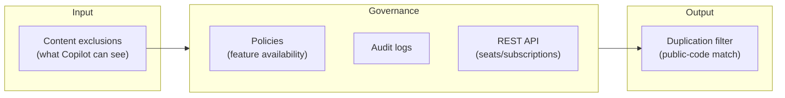

<!-- markdownlint-disable MD041 -->
# Chapter 8 — Administering Copilot: Plans, Policies & Safeguards

*Part II — GH-300 track: Working with GitHub Copilot*

---

## In 30 seconds

- **The core idea**: organizations control Copilot through policies, audit logs, subscription management,
  content exclusions, and safeguards like the public-code matching filter.
- **Why it matters**: admins decide where Copilot runs, what it can see, and how outputs are governed.
- **The exam angle**: GH-300 tests **organization-wide policy management**, **Copilot Code Review
  policies**, **feature availability across IDEs and github.com**, **audit log events**, **subscription
  management via REST API**, plus **content exclusions**, **output ownership/limitations**, **public-code
  filtering**, and **troubleshooting**.
- **Remember**: content exclusions limit what Copilot sees; the duplication filter limits what it emits.

---

## Exam map

**Exam map — GH-300 · Manage organization-wide settings and policies · Configure privacy, content exclusions, and safeguards**

---

## 1. Key concepts

Using Copilot well is one thing; **governing** it across an organization is another, and GH-300 tests both.
Administrators decide where Copilot runs, which features are available, what it is allowed to see, and how
its use is audited. Two safeguards recur throughout and are easy to confuse — keep them straight and much of
this chapter falls into place.

> 📌 **Key concept**: the two safeguards act on **opposite ends** of the flow (Chapter 2). **Content
> exclusions** control what Copilot can *see* (input side). The **duplication detection filter** controls
> what Copilot is allowed to *show* when output matches public code (output side).

> 📖 **Definition — Content exclusion**: an administrator setting that prevents specified files or
> repositories from being used as context by Copilot — they are never sent to the model. Used to keep
> secrets, sensitive data, or certain paths out of prompts.

> 📖 **Definition — Duplication detection filter (public-code match)**: an optional setting that suppresses
> suggestions matching public code on GitHub. It reduces the chance of surfacing code that resembles
> existing public repositories — an IP/licensing safeguard.

### Plans and where features apply

Copilot comes in plans (for example, individual, Business, and Enterprise) that differ in features, data
handling (Chapter 2), and administrative control. Administrators manage **feature availability** — which
capabilities are enabled — across **IDEs** and **github.com**, so an organization can, say, allow chat but
gate a Preview feature.

---

## 2. How it works

### Policies and feature management

Organization and enterprise owners set **policies** that enable or disable Copilot capabilities for members
— including whether **Copilot code review** is available, whether certain features run in IDEs versus on
github.com, and whether the duplication filter is on. Policies cascade from enterprise to organization,
giving central control with local flexibility.

> 🔍 **How it works**: policy management is about *availability*, content exclusions are about *visibility*,
> and the duplication filter is about *output*. A question that asks "how do I stop Copilot from reading
> `/secrets`?" is a **content exclusion**; "how do I stop suggestions that copy public code?" is the
> **duplication filter**; "how do I turn code review off for the org?" is a **policy**.

### Auditing use

> 📖 **Definition — Audit log events**: records of Copilot-related administrative and usage events (policy
> changes, feature toggles, and more) available to owners for oversight and compliance. Use them to answer
> "who changed what, and when?"

### Managing subscriptions with the REST API

Beyond the UI, GitHub exposes a **Copilot REST API** to manage seats/subscriptions programmatically — add
or remove users, list assignments, and pull usage — which scales administration for large orgs.

> 🖥️ **Hands-on**: configure a content exclusion so Copilot never sees sensitive paths. Exclusions are
> defined in repository or organization settings; the schema is YAML-like. Verify current syntax in GitHub
> Docs.
>
> ```yaml
> # Exclude paths from Copilot context (illustrative — confirm current schema)
> "*":
>   - "/secrets/**"
>   - "**/*.env"
> ```

### The public-code match filter and output ownership

Enabling the duplication filter suppresses suggestions that match public code. Separately, understand
**output ownership and limitations**: under GitHub's terms you generally own the suggestions you accept, but
you remain responsible for validating and for license compliance (Chapter 4). The filter reduces risk; it
does not transfer responsibility.



### Troubleshooting

When suggestions don't appear or exclusions seem ineffective, check the usual causes: the user's plan and
seat assignment, whether a **policy** disables the feature, whether a **content exclusion** is (correctly)
suppressing context, network/auth issues, and IDE extension status. Exclusions apply going forward and
depend on correct path patterns.

---

## 3. In the real world

**Scenario — rolling Copilot out to a regulated team.** A platform admin enables Copilot Business for the
org. She sets a **policy** allowing chat and code review but disabling a Preview feature until it's GA. She
adds **content exclusions** for the `secrets/` folder and all `*.env` files so credentials never reach the
model. She turns on the **duplication filter** to reduce public-code matches. She scripts seat assignment
with the **REST API** so onboarding is automatic, and she reviews **audit logs** weekly to confirm no
policy drift. Six controls, each mapped to a specific concern — visibility, availability, output, scale, and
oversight.

---

## 4. Exam tips

> 🎯 **Exam tip**: the most common trap is swapping the two safeguards. **Content exclusions = input
> (what Copilot sees)**; **duplication filter = output (what it shows when matching public code)**.

> 🎯 **Exam tip**: map the control to the goal — **policies** enable/disable features and set availability
> across IDEs and github.com; **audit logs** answer "who did what"; the **REST API** manages
> seats/subscriptions at scale.

> 🎯 **Exam tip**: you generally **own accepted suggestions**, but you remain responsible for validation
> and licensing. The duplication filter mitigates risk; it doesn't remove your responsibility.

> 🎯 **Exam tip**: content exclusions apply **going forward** and depend on correct **path patterns** — a
> common troubleshooting cause.

---

## 5. Common pitfalls

> ⚠️ **Pitfall**: assuming content exclusions retroactively purge data already processed. They stop future
> context; they are not a delete button.

- **Confusing exclusions with the duplication filter**: input visibility vs output matching.
- **Expecting policies to filter content**: policies govern *feature availability*, not what files are seen.
- **Wrong glob in an exclusion**: a mistyped path pattern silently fails to exclude — verify it.
- **Treating the duplication filter as a licensing guarantee**: it reduces matches; you still validate
  compliance.

---

## 6. Practice questions

**1.** An admin wants to ensure Copilot never uses files under `secrets/` as context. Which control?

- A. The duplication detection filter
- B. Content exclusions
- C. An audit log event
- D. A prompt file

<details markdown="1"><summary>Answer</summary>

**Correct: B.** Content exclusions keep specified paths out of the model's context. The duplication filter
(A) acts on outputs; C is a record; D is a reusable prompt.

</details>

**2.** Which control reduces the chance of Copilot showing suggestions that match public code?

- A. Content exclusions
- B. The duplication detection (public-code match) filter
- C. The REST API
- D. Audit logs

<details markdown="1"><summary>Answer</summary>

**Correct: B.** The duplication filter suppresses public-code matches (output side). A controls input; C
manages seats; D records events.

</details>

**3.** An organization wants to add and remove Copilot seats automatically as part of onboarding. What
should they use?

- A. The Copilot REST API for subscription/seat management
- B. Content exclusions
- C. The duplication filter
- D. A `.github/copilot-instructions.md` file

<details markdown="1"><summary>Answer</summary>

**Correct: A.** The REST API manages seats/subscriptions programmatically. B and C are safeguards; D sets
coding standards.

</details>

**4.** A developer reports Copilot suddenly stopped suggesting in a certain repository. Which is a plausible
*governance* cause to check first?

- A. The monitor refresh rate
- B. An organization policy disabling the feature, or a content exclusion covering those files
- C. The color theme
- D. The model's temperature

<details markdown="1"><summary>Answer</summary>

**Correct: B.** Policies (availability) and content exclusions (visibility) are the first governance causes
to check. A, C, and D are unrelated.

</details>

**5.** Which statement about accepted Copilot suggestions is correct?

- A. GitHub owns all suggestions you accept.
- B. You generally own accepted suggestions but remain responsible for validation and license compliance.
- C. Accepting a suggestion transfers all legal responsibility to GitHub.
- D. The duplication filter guarantees license compliance.

<details markdown="1"><summary>Answer</summary>

**Correct: B.** You generally own accepted output and stay responsible for it. A and C misstate ownership;
D overclaims the filter's role.

</details>

---

## Further reading

- **Chapter 2 — How GitHub Copilot Works**: why exclusions act on input and the match filter acts on output.
- **Chapter 4 — Using AI Responsibly**: validation and license responsibility that governance supports.

> 🔗 **Source**: [Configuring and auditing content exclusion for GitHub Copilot](https://docs.github.com/copilot/managing-copilot/configuring-and-auditing-content-exclusion)

> 🔗 **Source**: [Managing policies and features for Copilot in your organization](https://docs.github.com/copilot/managing-copilot/managing-github-copilot-in-your-organization)
