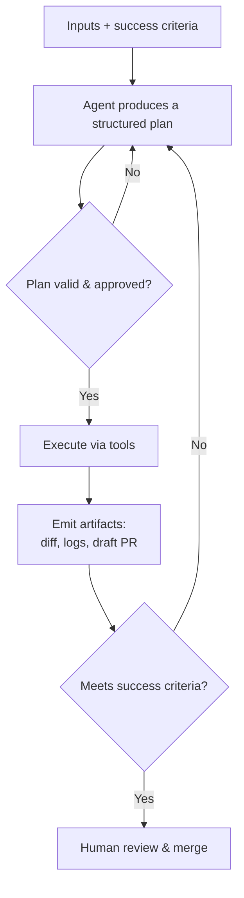

<!-- markdownlint-disable MD041 -->
# Chapter 9 — Agent Architecture & SDLC Integration

*Part III — GH-600 track: Developing agentic AI systems*

---

## In 30 seconds

- **The core idea**: a well-designed agent has clear steps, defined inputs/outputs/success criteria, a
  planning phase separate from action, and inspectable artifacts you can supervise.
- **Why it matters**: architecture decisions determine whether an agent is safe, reviewable, and useful in
  a real SDLC.
- **The exam angle**: GH-600 tests **identifying agent steps and anti-patterns**, **defining
  inputs/outputs/success criteria**, **separating planning from execution**, **structured plans and
  validation**, and **observability, autonomy, artifacts, and human intervention**.
- **Remember**: plan first, validate the plan, then act — with an audit trail.

---

## Exam map

**Exam map — GH-600 · Prepare agent architecture and SDLC processes**

---

## 1. Key concepts

Welcome to the GH-600 track. Part II was about *using* Copilot; from here on, you are *engineering* agents —
autonomous systems that plan, act, and produce work inside the software development lifecycle (SDLC), with
GitHub as the system of record. This first chapter is about **architecture**: what makes an agent reliable,
reviewable, and safe to run. Get the shape right and everything downstream — tools, memory, evaluation,
guardrails — becomes tractable.

> 📖 **Definition — Agent**: an AI system that pursues a goal by **planning** a sequence of steps, **taking
> actions** through tools, observing the results, and iterating — with some degree of autonomy — rather than
> producing a single response. In the GitHub context, an agent operates on repositories, issues, pull
> requests, and CI.

### Define the job before the agent

An agent is only as good as its specification. Before wiring anything, define three things:

- **Inputs** — what the agent receives (an issue, a failing test, a spec, a repository scope).
- **Outputs** — what "done" produces (a pull request, a report, a fix, an artifact).
- **Success criteria** — how you *know* it succeeded (tests pass, the check is green, the plan is approved).

> 📌 **Key concept**: an agent without explicit success criteria cannot be evaluated (Chapter 12) or
> trusted. "Make it better" is not a spec; "open a PR that fixes issue #123 with a passing regression test"
> is.

### Separate planning from action

> 📖 **Definition — Structured plan**: an explicit, inspectable list of the steps an agent intends to take,
> produced *before* it acts. Separating **planning/reasoning** from **execution** lets a human (or a policy)
> validate the plan and stop the agent before any change is made.

> 🔍 **How it works**: the pattern is *plan → validate → act*. Configure the agent to output a structured
> plan, validate it (automatically or with a human), and prevent action until the plan is approved. This is
> the single most important architectural decision for safety — it turns an opaque "it just did things" into
> a reviewable proposal. The Copilot CLI's **plan mode** is a concrete example.

---

## 2. How it works

### Anti-patterns to design out

| Anti-pattern | Why it hurts | Fix |
| --- | --- | --- |
| **No plan** — agent acts immediately | Unreviewable, unsafe changes | Plan → validate → act |
| **Unbounded scope** | Touches unrelated code; huge blast radius | Scope to a repo/branch/task (Chapter 10) |
| **No success criteria** | Can't tell success from failure | Define measurable outcomes |
| **No artifacts** | Nothing to review or audit | Emit inspectable artifacts (plan, logs, diff, PR) |
| **All-or-nothing autonomy** | Either micromanaged or dangerous | Right-size autonomy with guardrails (Chapter 14) |

### Observability and control by design

> 📖 **Definition — Inspectable artifact**: a durable, reviewable output an agent produces as it works — a
> structured plan, a session log, a diff, a draft pull request. Artifacts are how humans supervise an agent
> without watching every token.

GitHub's own coding agent illustrates the pattern: it works on a branch, opens a **draft pull request**,
writes **session logs** linked from each commit, and signs its commits so they appear "Verified." The change
is never invisible — it lands as a reviewable artifact in the normal SDLC.

> 🖥️ **Hands-on**: give an agent a durable specification it can plan against — an issue plus repository
> instructions. A well-written `.github/copilot-instructions.md` (Chapter 6) that documents build, test, and
> validation steps measurably improves an agent's plans and reduces failed runs.

### Right-sizing autonomy

Autonomy is a dial, not a switch. Plan how much the agent may do unattended, and where a human must
intervene — **without** turning every step into an approval that kills delivery speed (Chapter 14 formalizes
this). The goal: inspectable artifacts and intervention points at the moments that matter (irreversible or
risky actions), automation everywhere else.

---

## 3. In the real world

**Scenario — an agent that fixes flaky tests.** A team wants an agent to fix intermittently failing tests.
Instead of "go fix the tests," they specify it properly: **input** = a labeled issue linking the flaky test;
**output** = a draft PR on a `copilot/` branch; **success criteria** = the test passes 100 times in CI and
no other test regresses. They configure **plan mode** so the agent first proposes *which* tests it will
touch and *how* — a plan a human approves in seconds. The agent executes, emits a diff and session log,
opens a draft PR, and CI runs only after a maintainer approves the workflows. Because the architecture put
planning, scope, success criteria, and artifacts up front, the team supervises by exception — reading a plan
and a PR, not babysitting the model.

---

## 4. Exam tips

> 🎯 **Exam tip**: the core pattern is **plan → validate → act**. Configuring an agent to **output a
> structured plan** and **prevent action until approved** is the textbook safe design.

> 🎯 **Exam tip**: every agent needs **defined inputs, outputs, and success criteria**. Questions that
> describe an agent with no measurable success condition are describing an anti-pattern.

> 🎯 **Exam tip**: **inspectable artifacts** (plans, logs, diffs, draft PRs) are how you get observability
> and human intervention *without* slowing delivery. Recognize artifacts as the supervision mechanism.

> 🎯 **Exam tip**: know the common **anti-patterns** — acting without a plan, unbounded scope, no success
> criteria, no artifacts.

---

## 5. Common pitfalls

> ⚠️ **Pitfall**: letting an agent act before it plans. Without a validated plan, you lose the one
> checkpoint where a human can cheaply prevent a bad change.

- **Vague success criteria**: if you can't test "done," you can't trust or evaluate the agent.
- **Unbounded scope**: an agent allowed to touch anything will eventually touch the wrong thing.
- **No artifacts**: work that leaves no plan, log, or diff can't be reviewed or audited.
- **Autonomy as a switch**: full autonomy or full micromanagement — both fail; right-size per action risk.

---

## 6. Practice questions

**1.** What is the safest architectural pattern for an agent that changes code?

- A. Act first, then explain afterward.
- B. Produce a structured plan, validate/approve it, then execute.
- C. Give it full autonomy with no plan to maximize speed.
- D. Require a human to type every command.

Answer

**Correct: B.** Plan → validate → act provides a cheap, human-reviewable checkpoint before any change. A
removes the checkpoint; C is unsafe; D defeats the purpose of an agent.

**2.** Which trio must you define before building an agent?

- A. Colors, fonts, and layout
- B. Inputs, outputs, and success criteria
- C. Temperature, model, and seed
- D. Branch name, commit hash, and tag

Answer

**Correct: B.** Inputs, outputs, and measurable success criteria define the agent's job. The others are
incidental or unrelated.

**3.** How do you supervise an autonomous agent without watching every action?

- A. Disable logging to reduce noise.
- B. Rely on inspectable artifacts — plans, session logs, diffs, and draft pull requests.
- C. Trust it completely.
- D. Run it only on Fridays.

Answer

**Correct: B.** Artifacts make the agent's work reviewable and auditable. A hides information; C abandons
oversight; D is irrelevant.

**4.** Which is an agent anti-pattern?

- A. Scoping the agent to a specific repository and branch
- B. Emitting a structured plan before acting
- C. Acting immediately with unbounded scope and no success criteria
- D. Producing a draft pull request for review

Answer

**Correct: C.** Immediate, unbounded, unmeasurable action is the classic anti-pattern. A, B, and D are good
practices.

**5.** Why configure planning to be distinct from execution?

- A. It makes the agent slower on purpose.
- B. It lets a human or policy validate the plan and stop the agent before any change is made.
- C. It disables the agent's tools permanently.
- D. It removes the need for success criteria.

Answer

**Correct: B.** Separating plan from action creates a validation checkpoint. A, C, and D misstate the
purpose.

---

## Further reading

- **Chapter 10 — Tool Use & Environment Interaction (MCP)**: scoping and safe execution for agent actions.
- **Chapter 12 — Evaluation, Error Analysis & Tuning**: turning success criteria into evaluation signals.
- **Chapter 14 — Guardrails & Accountability**: right-sizing autonomy per action risk.

> 🔗 **Source**: [Study guide for Exam GH-600: Developing in Agentic AI Systems](https://learn.microsoft.com/credentials/certifications/resources/study-guides/gh-600)

> 🔗 **Source**: [Risks and mitigations for GitHub Copilot cloud agent](https://docs.github.com/copilot/concepts/agents/coding-agent/risks-and-mitigations)
