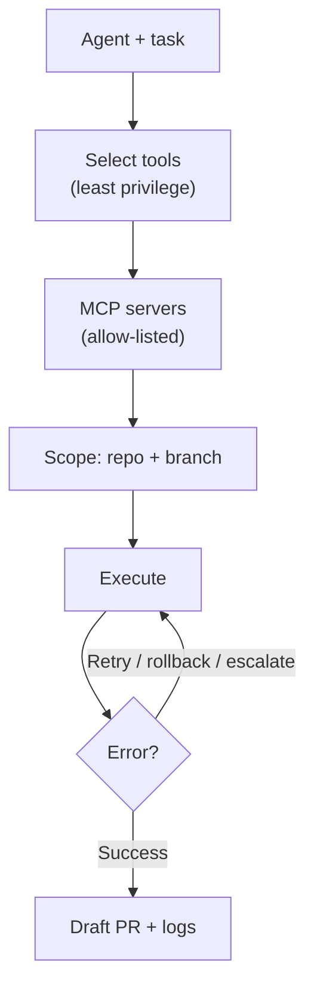

<!-- markdownlint-disable MD041 -->
# Chapter 10 — Tool Use & Environment Interaction (MCP)

*Part III — GH-600 track: Developing agentic AI systems*

---

## In 30 seconds

- **The core idea**: agents act through tools; MCP is the standard way to expose those tools, and scoping,
  permissions, and safe execution paths keep the agent contained.
- **Why it matters**: tool configuration is the largest GH-600 skill area (20–25%) and where most real risk
  lives.
- **The exam angle**: GH-600 tests **selecting/configuring tools and permissions**, **MCP servers (remote
  GitHub MCP, registries, allow lists)**, **execution context, repo/branch scoping, CI invocation,
  autonomous PRs, environment constraints**, and **safe execution (error handling, retries, rollbacks,
  escalation, traceability)**.
- **Remember**: least privilege on every tool; contain scope to a repo/branch.

---

## Exam map

**Exam map — GH-600 · Implement tool use and environment interaction**

---

## 1. Key concepts

An agent that can only think is useless; an agent that can *act* is powerful — and risky. Tools are how an
agent acts, MCP is the standard way to expose them, and scoping plus permissions are how you keep the agent
contained. This is the **largest GH-600 skill area (20–25%)** and where most real-world risk concentrates.

> 📖 **Definition — Tool**: a capability an agent can invoke to affect the world — read a file, run a
> command, query an API, open a pull request. Each tool is a potential action *and* a potential risk, so
> tools carry **permissions**.

> 📖 **Definition — MCP server**: a server implementing the **Model Context Protocol** that exposes a set
> of tools (and data) to an agent in a standard, discoverable way. Copilot ships with the **GitHub MCP
> server** preconfigured; you add others (remote HTTP or local) to extend what the agent can do.

### Select the right tools — and only those

> 📌 **Key concept**: apply **least privilege** to tools. Give the agent exactly the tools the task
> requires, with the narrowest permissions, and no more. An agent that only needs to read issues should not
> have a tool that can force-push.

---

## 2. How it works

### Configuring MCP servers

You add MCP servers to give an agent new tools. With the Copilot CLI (Chapter 5), you can add a remote
server directly or interactively:

> 🖥️ **Hands-on**: add a remote MCP server as a tool (verify current syntax in GitHub Docs).
>
> ```bash
> copilot mcp add --transport http sentry https://mcp.sentry.dev/mcp
> # or, inside an interactive session:
> /mcp add
> ```
>
> A JSON configuration describes each server (name, transport, URL/command). For example:
>
> ```json
> {
>   "servers": {
>     "github": { "type": "http", "url": "https://api.githubcopilot.com/mcp/" }
>   }
> }
> ```

### Governing MCP: allow lists and registries

At organization/enterprise scale, you control MCP centrally. Two mechanisms matter for the exam:

- The **"MCP servers in Copilot" policy** decides whether MCP servers may run at all. Recommended: keep it
  enabled and restrict to an approved list.
- **Allow lists** define which servers are permitted. The **recommended** method is an enterprise
  **`managed-settings.json`** file (generally available; secure matching by **name, URL, or `stdio`
  command**; users can't override it). An alternative is hosting your **own MCP registry** (public preview;
  weaker enforcement — matching by name/ID only, and users can bypass it by editing config).

> 📖 **Definition — MCP allow list**: an administrator-defined list of approved MCP servers. Prefer
> `managed-settings.json` for strong, non-overridable enforcement over a custom registry.

> 🎯 **Exam tip**: for *strong* MCP enforcement, the answer is the **managed settings file**, not a custom
> registry. The registry is weaker and bypassable.

### Scoping the execution environment

Where and how an agent runs is as important as which tools it has. Evaluate the **execution context** and
contain it:

- **Repository scope** — restrict the agent to a specific repository.
- **Branch scope** — GitHub's cloud agent pushes only to a **single branch**: a new `copilot/` branch, or
  the PR branch when triggered via `@copilot` on an existing PR. It is subject to **branch protections and
  required checks**.
- **CI invocation** — an agent can be invoked from a workflow, but by default **GitHub Actions workflows do
  not run** on the agent's PR until a user with write access approves them.
- **Autonomous branches/PRs** — the agent can create branches and open **draft** pull requests, but cannot
  mark them "Ready for review," approve, or merge.
- **Environment constraints** — restricted internet access (firewall) limits exfiltration; limited
  credentials mean it can only perform simple push operations, not arbitrary `git`.



### Safe execution paths

Actions fail; robust agents plan for it. Build in **error handling**, **retries** (with limits, so a loop
doesn't run forever), **rollbacks** (undo partial changes), **escalation paths** (hand off to a human when
stuck), and **traceability** (log every action for accountability, Chapter 14). GitHub's coding agent makes
its actions traceable via **signed commits**, **session logs**, and **audit log events**.

---

## 3. In the real world

**Scenario — an agent that triages incidents.** A platform team builds an agent that, given an alert, reads
related errors and opens a fix PR. It needs an **observability MCP server** (read-only) plus the GitHub MCP
server. The admin adds the observability server to the enterprise **`managed-settings.json`** allow list so
no one can wire up an unapproved one. The agent is **scoped** to the service's repository, pushes only to a
`copilot/` branch, and its workflows require a maintainer's approval before running. When a tool call to the
observability API times out, the agent **retries** twice, then **escalates** by commenting on the issue for
a human. Every action lands in the session log. Powerful automation — tightly contained.

---

## 4. Exam tips

> 🎯 **Exam tip**: **least privilege** on tools and **scoping** to a repo/branch are the recurring right
> answers for containing an agent.

> 🎯 **Exam tip**: strong MCP enforcement = enterprise **`managed-settings.json`** allow list (secure
> matching by name/URL/stdio). A **custom registry** is weaker and user-bypassable.

> 🎯 **Exam tip**: the cloud agent pushes to a **single branch**, opens **draft** PRs it can't merge, and
> its **workflows require human approval** to run. These are built-in environment guardrails.

> 🎯 **Exam tip**: safe execution means **error handling, retries, rollbacks, escalation, and
> traceability** — know all five.

---

## 5. Common pitfalls

> ⚠️ **Pitfall**: over-permissioning tools "to be safe." The opposite is safe — grant the minimum. Broad
> tool access widens the blast radius of any mistake or prompt injection.

- **Relying on a custom MCP registry for hard enforcement**: it's bypassable; use managed settings.
- **No retry/rollback/escalation**: an agent that can't recover or hand off will fail loudly or silently.
- **Ignoring branch/CI scoping**: letting an agent run workflows or push widely removes key guardrails.
- **No traceability**: without logs and signed commits, you can't audit what the agent did.

---

## 6. Practice questions

**1.** An enterprise wants to strictly limit which MCP servers Copilot can use, with enforcement users
cannot override. What should they use?

- A. A custom MCP registry
- B. An allow list in the enterprise `managed-settings.json` file
- C. A `.gitignore` entry
- D. Content exclusions

<details markdown="1"><summary>Answer</summary>

**Correct: B.** Managed settings provide GA, non-overridable enforcement with secure matching. A custom
registry (A) is weaker and bypassable; C and D are unrelated to MCP.

</details>

**2.** Which principle should guide the tools you give an agent?

- A. Grant every available tool for flexibility.
- B. Least privilege — only the tools the task requires, with the narrowest permissions.
- C. Grant write access to all repositories.
- D. Disable all tools so the agent can't act.

<details markdown="1"><summary>Answer</summary>

**Correct: B.** Least privilege minimizes blast radius. A and C over-permission; D makes the agent useless.

</details>

**3.** By default, when GitHub's cloud agent opens a pull request, what happens with GitHub Actions
workflows?

- A. They run automatically and immediately.
- B. They do not run until a user with write access approves them.
- C. They are permanently disabled.
- D. They run only if the agent approves them.

<details markdown="1"><summary>Answer</summary>

**Correct: B.** Workflows require human approval before running on the agent's PR. A and D remove the
guardrail; C is false.

</details>

**4.** A tool call fails intermittently. Which combination best describes a robust safe-execution design?

- A. Ignore the error and continue.
- B. Retry with a limit, roll back partial changes if needed, and escalate to a human when stuck — all logged.
- C. Retry forever until it succeeds.
- D. Immediately merge whatever exists.

<details markdown="1"><summary>Answer</summary>

**Correct: B.** Bounded retries, rollback, escalation, and traceability are the safe pattern. A hides
failure; C can loop forever; D is dangerous.

</details>

**5.** How is GitHub's cloud agent constrained in where it can write?

- A. It can push to any branch in any repository.
- B. It pushes only to a single branch (a `copilot/` branch or the PR branch), subject to branch protections.
- C. It can force-push to `main`.
- D. It has unrestricted Git access.

<details markdown="1"><summary>Answer</summary>

**Correct: B.** Single-branch scope plus branch protections contain it; its credentials only allow simple
push operations. A, C, and D describe access it does not have.

</details>

---

## Further reading

- **Chapter 6 — Copilot Capabilities**: MCP as an extensibility mechanism for Copilot.
- **Chapter 14 — Guardrails & Accountability**: permissions, autonomy levels, and least privilege in depth.

> 🔗 **Source**: [MCP server usage in your company (allow lists & registries)](https://docs.github.com/copilot/concepts/mcp-management)

> 🔗 **Source**: [Risks and mitigations for GitHub Copilot cloud agent](https://docs.github.com/copilot/concepts/agents/coding-agent/risks-and-mitigations)
