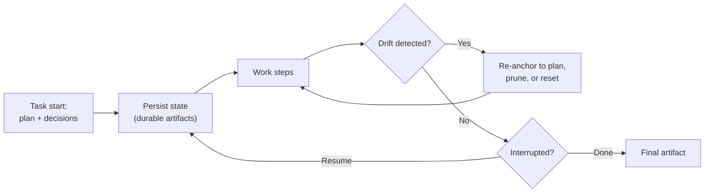

<!-- markdownlint-disable MD041 -->
# Chapter 11 — Memory, State & Execution

*Part III — GH-600 track: Developing agentic AI systems*

---

## In 30 seconds

- **The core idea**: agents need the right memory — short-term, long-term, or external — scoped to the task,
  with rules for expiry and reset, and durable state so work can resume without drift.
- **Why it matters**: memory choices determine whether an agent stays on track over a long task or diverges.
- **The exam angle**: GH-600 tests **choosing memory types**, **scoping memory**, **expiration/pruning/reset
  rules**, **persisting state as durable artifacts**, **resuming without repetition or divergence**,
  **detecting/correcting drift**, and **continuity across tools (no conflicting or stale context)**.
- **Remember**: scope memory to what the task needs; persist decisions as artifacts.

---

## Exam map

**Exam map — GH-600 · Manage memory, state, and execution**

---

## 1. Key concepts

An LLM is stateless (Chapter 1): between calls it remembers nothing. Agents that run for minutes or hours,
across many tool calls, need **memory** and **state** engineered around that limitation — or they forget
decisions, repeat work, and drift off course. GH-600 tests how you choose memory, scope it, persist state,
and keep an agent coherent over a long task and across tools.

> 📖 **Definition — Memory (agent)**: information an agent retains to inform future steps. It comes in
> three flavors: **short-term** (the working context of the current task, bounded by the context window),
> **long-term** (durable knowledge that persists across sessions), and **external** (retrieved on demand
> from a store, repo, or tool rather than held in context).

### Choose the right kind of memory

| Memory | Holds | Use it for |
| --- | --- | --- |
| **Short-term** | The current task's working context | The immediate reasoning and recent steps |
| **Long-term** | Persistent conventions, decisions, preferences | Knowledge reused across sessions |
| **External** | Data fetched on demand (files, DB, API) | Large or authoritative info you don't want in-context |

> 📌 **Key concept**: **scope memory to task-relevant information.** The context window is finite and noisy
> context degrades output (Chapter 3). More memory is not better; *relevant* memory is. GitHub's **Copilot
> Memory** illustrates long-term memory — it records coding conventions and preferences it deduces, so future
> sessions need less re-explaining.

### Manage the lifecycle of memory

> 📖 **Definition — Memory lifecycle rules**: policies for **expiration** (when memory goes stale),
> **pruning** (removing low-value entries to fit the window), and **reset** (clearing memory to start
> clean). Without them, memory grows unbounded, fills with stale facts, and misleads the agent.

---

## 2. How it works

### Persisting state as durable artifacts

> 📖 **Definition — State (agent)**: the record of *where the agent is* in its task — progress, decisions
> made, and what remains. Persisting state as **durable artifacts** (a plan file, a checklist, PR comments,
> a session log) lets an agent **resume** after interruption without repeating steps or contradicting
> earlier decisions.

> 🔍 **How it works**: the Copilot CLI shows the pattern in miniature. It **auto-compacts** history near
> the token limit and lets you `/resume` a session with its saved context — you pick up where you left off.
> The general principle: capture progress and decisions as artifacts so the agent (or a human) can continue
> deterministically.

### Detecting and correcting drift

> 📖 **Definition — Context drift**: the gradual divergence of an agent's behavior from the original intent
> during a long run — caused by accumulated noise, compaction losing key facts, or the agent "forgetting"
> a constraint. Detect it (the agent contradicts an earlier decision or the plan) and correct it (re-anchor
> to the plan/success criteria, prune noise, reset if needed).

### Continuity across tools and environments

When an agent spans tools or hands off to another agent (Chapter 13), you must **share state** deliberately
and avoid two failure modes: **conflicting context** (two sources disagree) and **stale context** (an old
value lingers after the truth changed). The fix is a single source of truth for shared state, with clear
ownership and freshness rules.

> 🖥️ **Hands-on**: give a long-running agent a durable, structured state artifact it updates as it works —
> for example, a checklist in the PR body or a `PLAN.md` — so a resumed or handed-off session reads current
> state instead of guessing.

---

## 3. In the real world

**Scenario — a migration that survives a restart.** An agent is migrating 40 API endpoints to a new
framework. It records a checklist in the pull request ("12 of 40 done, decision: keep legacy error codes")
as **durable state**. Halfway through, the session is interrupted. On **resume**, the agent reads the
checklist rather than starting over — no repeated work, no contradicting the error-code decision. Later, it
starts drifting, proposing a *different* error-handling style; a **drift check** against the recorded
decision catches it, and the agent re-anchors. Because state was persisted and scoped, a long, messy task
stayed coherent.

---

## 4. Exam tips

> 🎯 **Exam tip**: distinguish **short-term** (current context), **long-term** (persists across sessions),
> and **external** (retrieved on demand) memory — and pick the right one for the scenario.

> 🎯 **Exam tip**: **scope memory to task-relevant information** and apply **expiration/pruning/reset**.
> "Keep everything forever" is wrong — it causes stale context and blows the window.

> 🎯 **Exam tip**: to **resume without repeating or diverging**, persist progress and decisions as
> **durable artifacts**. Recognize this as the answer to "how does the agent continue after interruption?"

> 🎯 **Exam tip**: across tools/agents, prevent **conflicting** and **stale** context with a single source
> of truth for shared state.

---

## 5. Common pitfalls

> ⚠️ **Pitfall**: hoarding memory. Unbounded, unpruned memory fills the context window with stale noise and
> *worsens* behavior. Scope and prune.

- **No persisted state**: the agent can't resume; it repeats steps or contradicts earlier decisions.
- **Ignoring drift**: long runs silently diverge from intent without a re-anchoring check.
- **Stale context**: an outdated value lingers and misleads after the truth changed.
- **Conflicting context across tools**: multiple disagreeing sources with no owner.

---

## 6. Practice questions

**1.** An agent needs to remember a coding convention across many future sessions. Which memory type fits?

- A. Short-term memory
- B. Long-term memory
- C. No memory
- D. The context window alone

Answer

**Correct: B.** Long-term memory persists across sessions. Short-term (A/D) is bounded to the current task;
C forgets everything.

**2.** How should an agent resume a long task after an interruption without repeating work?

- A. Start over from scratch each time.
- B. Read durable state artifacts (plan, checklist, logs) that captured progress and decisions.
- C. Increase the temperature.
- D. Delete its previous work.

Answer

**Correct: B.** Persisted state lets it continue deterministically. A repeats work; C and D are unrelated or
harmful.

**3.** What is context drift?

- A. A network latency metric.
- B. The gradual divergence of an agent's behavior from the original intent during a long run.
- C. A type of MCP server.
- D. A billing model.

Answer

**Correct: B.** Drift is divergence from intent over time. The others are unrelated.

**4.** Why apply expiration and pruning rules to agent memory?

- A. To keep every fact forever for completeness.
- B. To prevent stale context and keep memory scoped within the finite context window.
- C. To disable long-term memory.
- D. To increase hallucinations.

Answer

**Correct: B.** Lifecycle rules keep memory relevant and bounded. A causes staleness/overflow; C and D are
wrong.

**5.** When an agent shares state across two tools, which two failure modes must you prevent?

- A. Conflicting context and stale context
- B. Fast context and slow context
- C. Public context and private context
- D. Signed context and unsigned context

Answer

**Correct: A.** Conflicting (disagreeing sources) and stale (outdated values) context are the risks; a
single source of truth prevents both. The others are not real categories here.

---

## Further reading

- **Chapter 9 — Agent Architecture & SDLC Integration**: plans and artifacts as the backbone of state.
- **Chapter 13 — Multi-Agent Orchestration**: sharing state safely across multiple agents.

> 🔗 **Source**: [About GitHub Copilot Memory](https://docs.github.com/copilot/concepts/agents/copilot-memory)

> 🔗 **Source**: [Study guide for Exam GH-600: Developing in Agentic AI Systems](https://learn.microsoft.com/credentials/certifications/resources/study-guides/gh-600)
