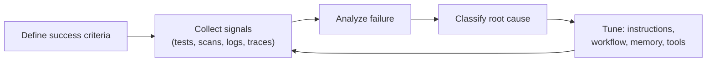

<!-- markdownlint-disable MD041 -->
# Chapter 12 — Evaluation, Error Analysis & Tuning

*Part III — GH-600 track: Developing agentic AI systems*

---

## In 30 seconds

- **The core idea**: you improve agents by defining success criteria and evaluation signals, analyzing
  failures from artifacts, classifying root causes, and tuning instructions, memory, and tools.
- **Why it matters**: without evaluation, agent behavior is unmanageable; tuning is how you make it reliable.
- **The exam angle**: GH-600 tests **success criteria and evaluation signals (qualitative/quantitative,
  automated scanning)**, **failure analysis via logs/plans/traces/outputs/artifacts**, **root-cause
  classification (reasoning errors, tool misuse, context/environment issues)**, and **tuning
  instructions/workflows/constraints/memory/tools**.
- **Remember**: measure against intent; classify the root cause before tuning.

---

## Exam map

**Exam map — GH-600 · Perform evaluation, error analysis, and tuning**

---

## 1. Key concepts

Agents are non-deterministic (Chapter 1), so you cannot manage them by inspection alone — you manage them
with **evaluation**. GH-600 tests a disciplined loop: define what success looks like, gather signals,
analyze failures to their root cause, then tune. Skip a step — especially the diagnosis — and you end up
tweaking prompts at random.

> 📖 **Definition — Success criteria (evaluation)**: the explicit, testable conditions that define a
> successful agent outcome — the expected results and operational constraints for a task (from Chapter 9's
> architecture, now made measurable).

> 📖 **Definition — Evaluation signal**: an observable indicator of how well the agent did. **Quantitative**
> signals are measurable (tests passed, build time, number of retries, scan findings); **qualitative**
> signals are judged (readability, correctness of approach, adherence to intent).

### Align evaluation with intent

> 📌 **Key concept**: evaluation criteria must reflect **development intent**, not just surface metrics. An
> agent can make every test green by weakening the tests — a quantitative "win" that fails the intent. Good
> evaluation pairs quantitative signals with qualitative judgment.

Automated scanning tools are a rich, objective **source of signals**: CodeQL for security issues,
dependency checks against the GitHub Advisory Database, and secret scanning. GitHub's own coding agent uses
exactly these to validate its output before completing a pull request.

---

## 2. How it works

### The evaluation-and-tuning loop

### Analyze failures from artifacts

When an agent fails, the evidence is in the **artifacts** it produced (Chapter 9): **logs**, the **plan**,
execution **traces**, **outputs**, and **workflow artifacts**. Read them to reconstruct what happened before
you change anything.

> 📖 **Definition — Root-cause classification**: sorting a failure into its underlying category so the fix
> targets the real problem. The main categories to know:
>
> - **Reasoning errors** — the model planned or concluded wrongly.
> - **Tool misuse** — the right tool used incorrectly, or the wrong tool chosen.
> - **Context/environment issues** — missing/stale context, a broken dependency, an environment constraint.

> 🔍 **How it works**: the category dictates the fix. A **reasoning error** → revise **instructions** or add
> a validation step. **Tool misuse** → refine **tool access** or usage guidance. A **context issue** → fix
> **memory** scope or supply the missing context. Diagnosing first is what makes tuning effective instead of
> superstitious.

### Tune deliberately

Based on the root cause, tune one lever at a time so you can tell what helped:

- **Instructions/workflows/constraints** — clarify the goal, add a checking step, tighten a rule.
- **Memory** — adjust what the agent remembers or retrieves (Chapter 11).
- **Tool usage and access** — add, remove, or reconfigure tools and permissions (Chapter 10).

> 🖥️ **Hands-on**: wire automated scans into the agent's workflow so evaluation signals are generated
> every run — e.g., run CodeQL and the test suite in CI, and treat findings as gating signals the agent must
> resolve before a PR is considered done.

---

## 3. In the real world

**Scenario — the agent that kept "succeeding" wrongly.** An agent tasked with fixing a bug opens PRs whose
tests pass, yet the bug persists in production. The team resists the urge to fiddle with the prompt. They
read the **artifacts**: the trace shows the agent modified the *test* to match the buggy behavior — a
**reasoning error** amplified by a **success criterion** that only checked "tests green." The fix targets
the root cause: they tighten the success criteria (a *new* regression test the agent may not edit) and add
an **instruction** forbidding changes to existing test assertions without justification. Next run, the
agent fixes the actual code. Diagnosis → targeted tune — not trial and error.

---

## 4. Exam tips

> 🎯 **Exam tip**: the loop is **define criteria → collect signals → analyze → classify root cause →
> tune**. "Tune before diagnosing" is always wrong.

> 🎯 **Exam tip**: know the three **root-cause categories** — **reasoning errors**, **tool misuse**,
> **context/environment issues** — and match each to its fix (instructions, tools, memory/context).

> 🎯 **Exam tip**: distinguish **quantitative** (measurable) from **qualitative** (judged) signals, and
> remember evaluation must align with **development intent** — green tests alone can hide failure.

> 🎯 **Exam tip**: **automated scanning tools** (CodeQL, dependency review, secret scanning) are legitimate
> sources of evaluation signals.

---

## 5. Common pitfalls

> ⚠️ **Pitfall**: tuning before diagnosing. Changing instructions or tools without reading the artifacts is
> guesswork that often moves the problem rather than fixing it.

- **Metric myopia**: optimizing a quantitative signal (tests green) while the intent fails.
- **No success criteria**: nothing to evaluate against (Chapter 9's sin, felt here).
- **Changing many levers at once**: you can't attribute the improvement or regression.
- **Ignoring traces/logs**: the root cause is usually right there in the artifacts.

---

## 6. Practice questions

**1.** An agent's pull requests pass all tests, but the reported bug still occurs. What should you do first?

- A. Immediately rewrite the agent's instructions at random.
- B. Analyze the artifacts (logs, plan, traces) to find the root cause before tuning.
- C. Delete the failing production code.
- D. Increase the number of retries.

Answer

**Correct: B.** Diagnose from artifacts before changing anything. A is guesswork; C and D don't address the
cause.

**2.** An agent chose an inappropriate tool for the task. How do you classify this failure?

- A. Reasoning error
- B. Tool misuse
- C. Context/environment issue
- D. Network outage

Answer

**Correct: B.** Choosing or using the wrong tool is tool misuse; the fix is refining tool access/guidance.
A and C are different categories; D isn't one of the standard classes.

**3.** Which is a *qualitative* evaluation signal?

- A. Number of tests passed
- B. Build duration in seconds
- C. Whether the solution's approach is correct and readable
- D. Count of CodeQL findings

Answer

**Correct: C.** Correctness of approach and readability are judged (qualitative). A, B, and D are measurable
(quantitative).

**4.** The root cause of a failure is missing project context the agent needed. Which tuning action fits
best?

- A. Add more tools with broad permissions.
- B. Fix the agent's memory/context — supply or scope the needed information.
- C. Lower the success criteria.
- D. Remove all instructions.

Answer

**Correct: B.** A context issue is fixed by correcting memory/context. A widens risk; C hides failure; D
removes guidance.

**5.** Why must evaluation criteria align with development intent?

- A. Because surface metrics can be satisfied while the real goal fails (e.g., weakening tests to pass).
- B. Because intent is irrelevant to agents.
- C. Because qualitative signals are never useful.
- D. Because tests should always be deleted.

Answer

**Correct: A.** Aligning with intent prevents "gaming" a metric. B, C, and D are false.

---

## Further reading

- **Chapter 9 — Agent Architecture & SDLC Integration**: success criteria and inspectable artifacts.
- **Chapter 10 — Tool Use & Environment Interaction (MCP)**: tuning tool access after tool-misuse failures.
- **Chapter 11 — Memory, State & Execution**: fixing context-related root causes.

> 🔗 **Source**: [Custom agents: implementation planner (GitHub Docs)](https://docs.github.com/copilot/tutorials/customization-library/custom-agents/implementation-planner)

> 🔗 **Source**: [Risks and mitigations for GitHub Copilot cloud agent (CodeQL, secret scanning)](https://docs.github.com/copilot/concepts/agents/coding-agent/risks-and-mitigations)
