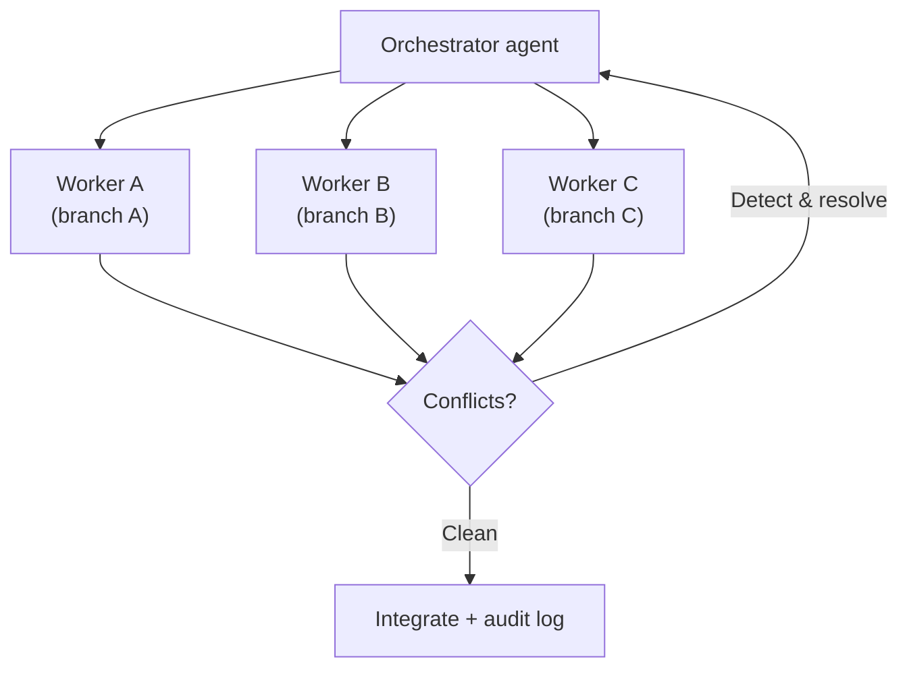

<!-- markdownlint-disable MD041 -->
# Chapter 13 — Multi-Agent Orchestration

*Part III — GH-600 track: Developing agentic AI systems*

---

## In 30 seconds

- **The core idea**: coordinating several agents needs an orchestration pattern, isolation for parallel
  work, conflict resolution, shared observability, and recovery when one agent stalls or fails.
- **Why it matters**: real workflows use multiple agents; coordination failures are subtle and costly.
- **The exam angle**: GH-600 tests **orchestration patterns**, **isolation for parallel execution**,
  **conflict detection/resolution (overlapping changes, duplicated effort, contradictory outputs)**,
  **observability via artifacts**, **post-hoc analysis**, **multi-agent failure recovery (rollback,
  human-in-the-loop)**, and **agent lifecycle within workflows**.
- **Remember**: isolate to parallelize; produce artifacts to audit; recover with rollback/HITL.

---

## Exam map

**Exam map — GH-600 · Orchestrate multi-agent coordination**

---

## 1. Key concepts

One agent is a tool; several agents working together is a system — and systems fail in ways single agents
don't. GH-600 tests how you coordinate multiple agents: choosing an orchestration pattern, isolating them
to work in parallel, resolving conflicts, keeping the whole thing observable, recovering from failures, and
managing agents' lifecycle without disrupting active work.

> 📖 **Definition — Orchestration pattern**: the structure that coordinates multiple agents toward a shared
> goal. Common shapes include an **orchestrator/worker** pattern (a lead agent delegates sub-tasks to
> specialized agents — the sub-agent idea from Chapter 6, scaled up), **sequential** pipelines (one agent's
> output feeds the next), and **parallel** fan-out/fan-in.

### Isolate to parallelize

> 📖 **Definition — Agent isolation**: giving each agent its own context, scope, and workspace (for example,
> separate branches or working directories) so parallel agents don't interfere. Isolation is the
> precondition for safe parallelism.

> 📌 **Key concept**: the main hazard of multiple agents is **collision** — two agents making **overlapping
> code changes**, doing **duplicated effort**, or producing **contradictory outputs**. Isolation prevents
> most collisions; conflict detection and resolution handle the rest.

---

## 2. How it works

### Detecting and resolving conflicts

When agents share a codebase, you need to **detect** conflicts (overlapping diffs, duplicate work,
contradictory decisions) and **resolve** them — by isolating scopes further, serializing the conflicting
step, designating an authority, or escalating to a human. GitHub's normal mechanisms help: branch scoping
(Chapter 10), pull requests, and required reviews surface overlaps the way they do for human contributors.

### Observability across agents

> 📖 **Definition — Multi-agent observability**: producing artifacts that make the *collective* behavior
> reviewable — logs, decisions, **handoffs**, and outcomes documented across agents, suitable for review and
> audit. Without it, a multi-agent run is an unauditable black box.

Document **key decisions, handoffs, and outcomes** so you can perform **post-hoc analysis** — reconstruct
what each agent did and why after the fact. GitHub's signed commits, session logs, and audit events
(Chapter 14) extend naturally to multiple agents.

### Detecting and recovering from failures

Agents can end up **failed**, **partial**, or **stalled**. Detect these states and apply **recovery
patterns**: **rollback** partial work, **retry** a step, or fall back to **human-in-the-loop**. Degraded
coordination (agents talking past each other) is itself a failure mode to detect and correct.

### Managing the agent lifecycle within a workflow

> 🔍 **How it works**: multi-agent systems evolve while running. You must be able to **add** an agent,
> **update/reconfigure/replace** one, and **retire** one — all **without disrupting active workflows** and
> while **preserving auditability**. Treat agents like services: version them, drain work before retiring,
> and keep their history.

> 🖥️ **Hands-on**: give each parallel agent its own `copilot/` branch and a shared, append-only decision
> log (e.g., a coordination issue). Overlaps then surface as PR conflicts, and the log provides the audit
> trail for post-hoc analysis.

---

## 3. In the real world

**Scenario — three agents, one codebase.** A team runs three agents in parallel to modernize a service: one
per module. Each is **isolated** on its own `copilot/` branch (scope from Chapter 10), and they log
decisions to a shared coordination issue. Two agents both refactor a shared utility — an **overlapping
change**. Because each works on its own branch and opens a PR, the conflict surfaces at integration; the
orchestrator **serializes** the utility change to one agent and has the other rebase. Midway, a third agent
**stalls** on a flaky dependency; the system detects the stall and **escalates** to a human. Afterward, the
shared log enables **post-hoc analysis** of who changed what. Parallel speed, with collisions caught and
audited.

---

## 4. Exam tips

> 🎯 **Exam tip**: the three multi-agent conflict types are **overlapping code changes**, **duplicated
> effort**, and **contradictory outputs**. **Isolation** (separate scopes/branches/contexts) is the primary
> prevention.

> 🎯 **Exam tip**: multi-agent runs need **artifacts for review and audit** — documented decisions,
> handoffs, and outcomes enabling **post-hoc analysis**.

> 🎯 **Exam tip**: recovery for **failed/partial/stalled** agents uses **rollback** and
> **human-in-the-loop**. Recognize these as the multi-agent recovery patterns.

> 🎯 **Exam tip**: lifecycle management means adding, updating/replacing, and **retiring** agents
> **without disrupting active workflows** and while **preserving auditability**.

---

## 5. Common pitfalls

> ⚠️ **Pitfall**: running agents in parallel **without isolation**. Shared scope leads to overlapping edits,
> duplicated work, and contradictory outputs.

- **No conflict detection**: collisions merge silently and corrupt the result.
- **No shared observability**: you can't audit or analyze what the collective did.
- **No recovery for stalls**: a stalled agent hangs the whole workflow.
- **Disruptive lifecycle changes**: swapping an agent mid-run breaks active work or loses history.

---

## 6. Practice questions

**1.** What is the primary way to let multiple agents work in parallel safely?

- A. Give them all write access to the same branch.
- B. Isolate each agent with its own scope/context (e.g., separate branches).
- C. Disable logging to reduce overhead.
- D. Run them one at a time only.

Answer

**Correct: B.** Isolation prevents collisions and enables safe parallelism. A causes overlaps; C removes
auditability; D isn't parallel at all.

**2.** Which is a multi-agent conflict type to detect and resolve?

- A. Overlapping code changes
- B. A slow network
- C. A large context window
- D. A signed commit

Answer

**Correct: A.** Overlapping changes (plus duplicated effort and contradictory outputs) are the conflict
types. The others aren't conflicts.

**3.** An agent in a multi-agent workflow has stalled on a dependency. Which recovery approach fits?

- A. Ignore it and merge the rest.
- B. Detect the stall and apply a recovery pattern such as rollback or human-in-the-loop.
- C. Delete the repository.
- D. Give the agent more permissions.

Answer

**Correct: B.** Detect the degraded state and recover via rollback/HITL. A hides the problem; C is
destructive; D doesn't address the stall.

**4.** How do you enable post-hoc analysis of a multi-agent run?

- A. Turn off all logging.
- B. Document decisions, handoffs, and outcomes as auditable artifacts.
- C. Rely on the agents' memory only.
- D. Merge without review.

Answer

**Correct: B.** Auditable artifacts let you reconstruct behavior afterward. A and C destroy the record; D
skips oversight.

**5.** You need to retire one agent from a running multi-agent workflow. What matters most?

- A. Do it instantly regardless of active work.
- B. Retire it without disrupting active workflows and while preserving auditability.
- C. Delete all its past logs first.
- D. Give its permissions to every other agent.

Answer

**Correct: B.** Lifecycle changes must preserve continuity and history. A disrupts work; C destroys the
audit trail; D over-permissions.

---

## Further reading

- **Chapter 10 — Tool Use & Environment Interaction (MCP)**: branch scoping that isolates agents.
- **Chapter 11 — Memory, State & Execution**: sharing state without conflicting or stale context.
- **Chapter 14 — Guardrails & Accountability**: audit trails and human-in-the-loop across agents.

> 🔗 **Source**: [Study guide for Exam GH-600: Developing in Agentic AI Systems](https://learn.microsoft.com/credentials/certifications/resources/study-guides/gh-600)

> 🔗 **Source**: [Risks and mitigations for GitHub Copilot cloud agent (auditability)](https://docs.github.com/copilot/concepts/agents/coding-agent/risks-and-mitigations)
