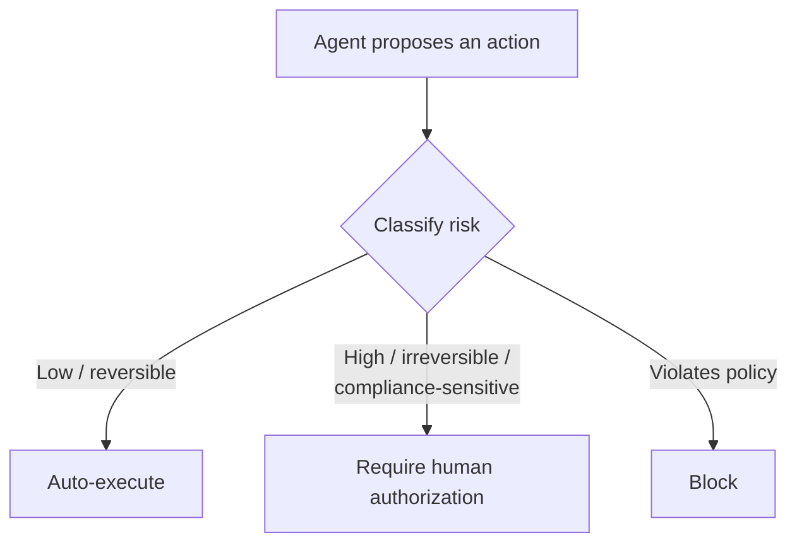

<!-- markdownlint-disable MD041 -->
# Chapter 14 — Guardrails & Accountability

*Part III — GH-600 track: Developing agentic AI systems*

---

## In 30 seconds

- **The core idea**: right-size autonomy by classifying actions by risk, insert human judgment only where it
  matters, block policy violations, and enforce least privilege — without killing velocity.
- **Why it matters**: guardrails are what make autonomous agents safe to run in production.
- **The exam angle**: GH-600 tests **classifying actions by operational/security/compliance risk**,
  **assigning autonomy levels**, **human-in-the-loop for high-judgment actions**, **blocking
  policy-violating actions**, **least-privilege scoping**, **explicit authorization for irreversible
  changes**, and **preserving velocity by minimizing low-value approvals**.
- **Remember**: match the control to the risk — approve the irreversible, automate the safe.

---

## Exam map

**Exam map — GH-600 · Implement guardrails and accountability**

---

## 1. Key concepts

Everything in the GH-600 track converges here: guardrails are what make autonomous agents *safe to run in
production*. The discipline is to **match the control to the risk** — automate the safe and reversible,
require human judgment for the risky and irreversible — without drowning delivery in needless approvals.
This is the responsible-AI thinking of Chapter 4, now enforced on agents.

> 📖 **Definition — Guardrail**: a constraint that limits what an agent may do — a permission boundary, a
> required approval, a blocked action, an execution scope. Guardrails turn "the agent can do anything" into
> "the agent can do exactly what's safe."

> 📖 **Definition — Autonomy level**: the degree of independent action granted to an agent for a class of
> actions. You **classify actions by risk** — operational, security, compliance — and assign an autonomy
> level that maximizes delivery speed while staying within security and Responsible AI standards.

### Classify by risk, then right-size autonomy

> 📌 **Key concept**: not all actions deserve the same scrutiny. Reading an issue is low risk; deploying to
> production is high and irreversible. Classify each action by **operational, security, and compliance
> risk**, then apply the *lightest* control that adequately manages it. Uniform approvals are an
> anti-pattern — they slow everything without reducing the risks that matter.

---

## 2. How it works

### Human-in-the-loop where judgment is needed

> 📖 **Definition — Human-in-the-loop (HITL)**: a checkpoint requiring explicit human approval before the
> agent proceeds. Reserve HITL for the subset of actions that genuinely need judgment or are irreversible/
> compliance-sensitive; automate the rest to preserve velocity.

### GitHub's built-in guardrails (a concrete model)

GitHub's coding agent is a worked example of these principles — and a rich exam source:

- **Least privilege & scope**: only users with **write access** can trigger it; it pushes to a **single
  branch** (a `copilot/` branch or the PR branch) subject to branch protections; its credentials allow only
  **simple push**, not arbitrary `git`.
- **HITL for the irreversible**: it opens **draft** PRs it **cannot** mark ready, approve, or merge — a
  human must review and merge. **GitHub Actions workflows don't run** until a user with write access
  approves them.
- **Separation of duties**: the person who asked the agent for a PR **can't approve it**, preserving
  required-approval rules; an **extra approval** is required when a PR **isn't attributed to a person**.
- **Blocking & containment**: restricted **internet access** limits exfiltration; **hidden characters are
  filtered** to mitigate **prompt injection**.
- **Built-in validation**: **CodeQL**, **dependency review** against the GitHub Advisory Database, and
  **secret scanning** run on generated code — no GitHub Advanced Security license required.

> 📖 **Definition — Least privilege**: granting the minimum permissions and narrowest execution scope an
> action requires. It caps the blast radius of any mistake, bug, or injected instruction.

### Accountability: traceable by design

> 🔍 **How it works**: guardrails are only half the story; you must be able to answer *who did what*.
> GitHub makes agent work **accountable**: commits are **authored by Copilot with the requesting developer
> as co-author**, commits are **signed** ("Verified"), and each links to **session logs**, with **audit log
> events** for administrators. Accountability ultimately rests with the humans who configure and approve —
> the agent is never the responsible party (Chapter 4).

> 🖥️ **Hands-on**: encode guardrails in the platform, not in hope — branch protection + required reviews,
> the "require approval for unattributed Copilot PRs" ruleset, workflow-approval settings, and a scoped
> tool/MCP allow list (Chapter 10). The agent then *cannot* exceed policy, regardless of what it "decides."

---

## 3. In the real world

**Scenario — shipping fast, safely.** A team lets an agent fix bugs and open PRs autonomously — a
low-to-moderate-risk, reversible flow, so no per-step approval. But **deploying** is high-risk and
irreversible, so it's gated behind **HITL**: the agent may open the release PR, but a human must approve and
merge, and workflows require write-access approval to run. Because the agent runs with **least privilege** on
a scoped branch, a prompt-injection attempt in an issue can't escalate — it can't touch `main`, exfiltrate
over the network, or run workflows unapproved. Every commit is signed and linked to a session log. The team
moves quickly on the safe majority of actions and slows down only where it matters.

---

## 4. Exam tips

> 🎯 **Exam tip**: the governing principle is **match the control to the risk** — automate low-risk/
> reversible actions, require **HITL** for high-risk/irreversible/compliance-sensitive ones, and **block**
> policy violations. Uniform approval of everything is wrong (it kills velocity without targeting risk).

> 🎯 **Exam tip**: **least privilege** and **scoped execution** are the recurring right answers for
> containing an agent and limiting prompt-injection impact.

> 🎯 **Exam tip**: know GitHub's concrete guardrails — **write-access to trigger**, **single-branch push**,
> **draft PRs it can't merge**, **workflows need approval**, **requester can't approve**, **extra approval
> for unattributed PRs**, **restricted internet**, **CodeQL/secret scanning**.

> 🎯 **Exam tip**: accountability = **signed, co-authored commits + session logs + audit events**; the
> **human** remains responsible.

---

## 5. Common pitfalls

> ⚠️ **Pitfall**: requiring human approval for *every* action. It doesn't materially reduce risk for safe
> actions and destroys the velocity that makes agents worthwhile. Approve the irreversible; automate the
> rest.

- **Over-permissioning**: broad tokens/scope widen the blast radius and injection impact.
- **Automating irreversible actions**: deploys, force-pushes, and data deletions need HITL.
- **No audit trail**: without signed commits and logs, you can't hold anyone accountable.
- **Treating the agent as accountable**: responsibility is always human.

---

## 6. Practice questions

**1.** Which principle should govern how much autonomy you grant an agent for a given action?

- A. Grant full autonomy for everything to maximize speed.
- B. Match the control to the action's risk — automate low-risk/reversible, require human approval for high-risk/irreversible.
- C. Require human approval for every single action.
- D. Base it on the time of day.

Answer

**Correct: B.** Right-size autonomy by risk. A is unsafe; C destroys velocity without targeting risk; D is
arbitrary.

**2.** By default, can GitHub's coding agent merge its own pull request?

- A. Yes, automatically.
- B. No — it opens a draft PR that a human must review and merge; it cannot approve or merge.
- C. Yes, if it passes tests.
- D. Only on weekends.

Answer

**Correct: B.** Human review and merge are required; the agent can't mark ready, approve, or merge. A, C,
and D are false.

**3.** How does least privilege help against prompt injection in an agent?

- A. It prevents the model from ever being wrong.
- B. It limits the blast radius — even a successful injection can only do what the narrow permissions allow.
- C. It disables the agent entirely.
- D. It has no effect on injection.

Answer

**Correct: B.** Minimal permissions cap what any injected instruction can achieve. A overclaims; C is
extreme; D is false.

**4.** A repository requires at least one approval. Why does GitHub prevent the person who asked the agent
for a PR from approving it?

- A. To slow down that developer specifically.
- B. To preserve separation-of-duties / required-approval controls.
- C. Because approvals are disabled for agents.
- D. Because the agent approves it instead.

Answer

**Correct: B.** Preventing self-approval preserves the expected required-approval controls. A is wrong; C
and D misstate the behavior.

**5.** Which best describes accountability for an autonomous agent's work on GitHub?

- A. The agent is legally responsible for the code.
- B. Work is traceable (signed, co-authored commits; session logs; audit events), and humans remain accountable.
- C. There is no way to tell what the agent did.
- D. Only the model provider is accountable.

Answer

**Correct: B.** Agent work is auditable and humans stay responsible. A and D misplace accountability; C is
false given signed commits and logs.

---

## Further reading

- **Chapter 4 — Using AI Responsibly**: the responsible-AI principles guardrails enforce.
- **Chapter 10 — Tool Use & Environment Interaction (MCP)**: least privilege, scoping, and allow lists.
- **Chapter 9 — Agent Architecture & SDLC Integration**: right-sizing autonomy and human intervention points.

> 🔗 **Source**: [Risks and mitigations for GitHub Copilot cloud agent](https://docs.github.com/copilot/concepts/agents/coding-agent/risks-and-mitigations)

> 🔗 **Source**: [Study guide for Exam GH-600: Developing in Agentic AI Systems](https://learn.microsoft.com/credentials/certifications/resources/study-guides/gh-600)
